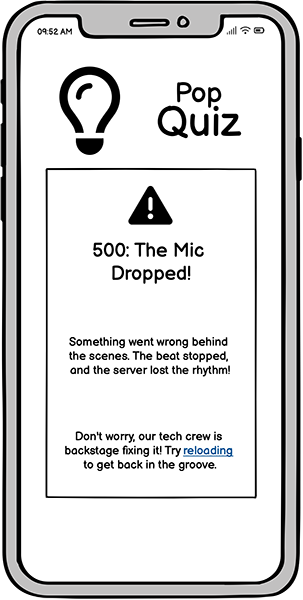
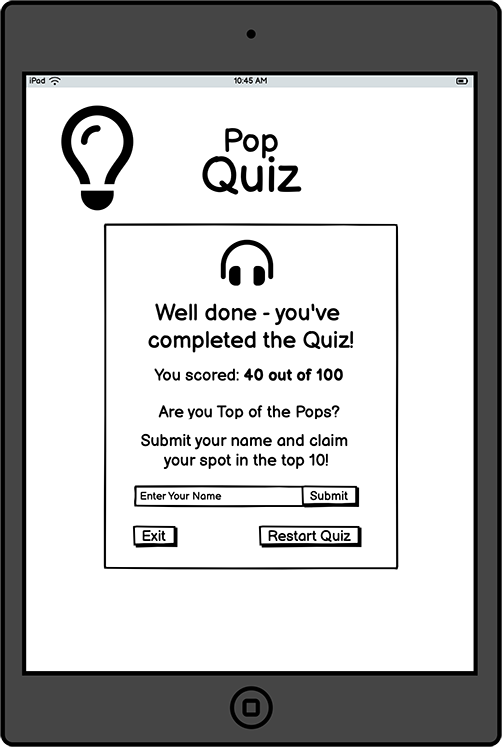
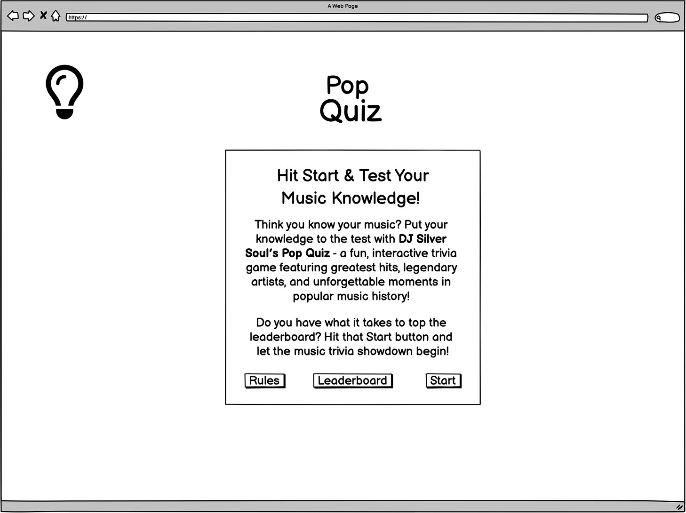
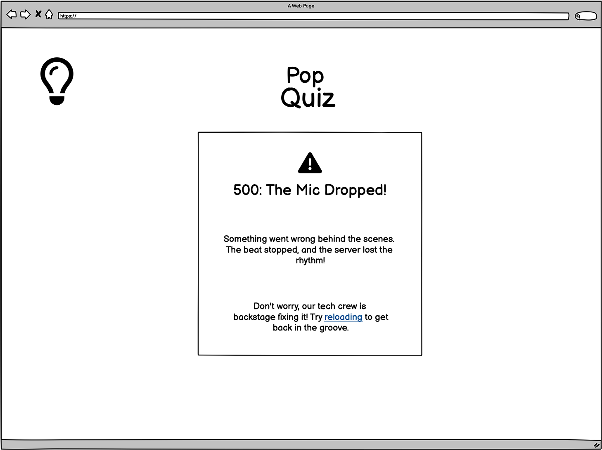

# Think you know your music?

---

Visit the deployed site here:

## Introduction

**DJ Silver Soul Pop Quiz** is an interactive, disco-themed music trivia game designed to test and entertain players with questions about popular music from past to present.

Music quizzes boost memory, improve learning, and enhance critical thinking while triggering dopamine release for better mood and reduced stress. They also help keep the brain sharp, making them both fun and beneficial.

The game features a fast-paced multiple-choice format where players race against the clock to answer questions and secure a spot on the leaderboard. This competitive element encourages replayability, motivating players to return and beat their own high scores.

---

## CONTENTS

- [User Experience](#ux)

  - [User Stories](#user-stories)

- [Design](#Design)
  - [Colour Scheme](#colour-scheme)
  - [Typography](#typography)
  - [Imagery](#imagery)
  - [Wireframes](#wireframes)
    - [Mobile Wireframes](#mobile-frames)
    - [Tablet Wireframes](#tablet-frames)
    - [Desktop Wireframes](#desktop-frames)

---

## User Experience (UX)

The quiz is built with the player in mind, offering an engaging and immersive experience. Below are the key user-centric principles that make the game fun, intuitive, and rewarding for all music lovers:

1. **Engaging & Fun Experience** – The quiz is designed to be entertaining, immersive, and enjoyable for all music lovers
2. **Easy-to-Use Interface** – A clean, intuitive UI ensures seamless navigation and accessibility for players of all skill levels
3. **Responsive & Fast-Paced Gameplay** – Players answer multiple-choice questions against the clock, keeping the game dynamic and exciting
4. **Competitive & Replayable** – A leaderboard system encourages users to return, improve their scores, and challenge friends
5. **Interactive Feedback** – Instant response to answers (correct/incorrect) enhances the learning experience and player satisfaction
6. **Social Sharing Features** – Encourages players to share their scores and challenge friends, increasing engagement and reach
7. **Mobile-Friendly Design** – Optimized for desktop and mobile play to ensure accessibility anytime, anywhere
8. **Encourages Learning & Memory Recall** – Combining music knowledge with trivia boosts memory retention and cognitive skills

### User Stories

#### New Site Users

- As a new site user, I want to understand the game rules quickly, so that I can start playing without confusion.
- As a new site user, I want to engage instantly with the design and interface, so that I feel excited and motivated to play.
- As a new site user, I want to start my first quiz easily, so that I can jump straight into the fun.
- As a new site user, I want to play against a timer, so that I feel a sense of challenge and excitement while answering questions quickly.
- As a new site user, I want to see my score and progress, so that I feel motivated to improve and replay.

#### Returning Site Users

- As a returning site user, I want to select the difficulty level of quiz questions, so that I can tailor the challenge to my knowledge and skill level.

#### Frequent Visitor Goals

- As a frequent site user, I want to see a leaderboard of top quiz scores, so that I can compare my performance with others and stay motivated to improve.

---

## Design

### Colour Scheme

The site's color scheme draws inspiration from the vibrant neon lights of a 1970s disco, featuring bold, electrifying hues that evoke the energy, excitement, and retro-futuristic aesthetics of the era. The glowing, high-contrast palette enhances the immersive experience, creating a visually dynamic atmosphere reminiscent of classic dance floors, shimmering reflections, and the iconic nightlife of the time.

The primary colours for the site are

To boost user engagement and draw attention to key areas, I selected distinct highlight colors that complemented the background visuals. These colors were defined as root variables in my CSS file, allowing for effortless adjustments across the site.

- `4f9aff` (Bright Blue): Used to emphasize key UI elements, drawing user focus to interactive components.
- `e83c5a` (Red): Clearly signals an incorrect answer, creating an instant visual cue for mistakes.
- `4eb738` (Green): Indicates a correct answer, reinforcing success with a positive color association.
- `f59527` (Gold): Represents the user’s score, evoking achievement and reward with a warm, celebratory tone.

This color scheme enhances clarity, feedback, and user experience while maintaining a cohesive, vibrant aesthetic.

- Toggle the arrow to view the colour swatches

### Typography

Google Fonts was used to import the selected fonts for the site, ensuring high-quality and easily accessible typography.

- **h1, h2 and h3 headings** The font [Roboto](https://fonts.google.com/specimen/Roboto?preview.text=Think%20you%20know%20your%20music%3F) was chosen because it offers a clean, modern, and highly readable design that enhances user experience while maintaining a professional and contemporary look.

- **paragraph elements:** The font [Inter](https://fonts.google.com/specimen/Inter) was chosen as a font pairing for Roboto because its geometric yet friendly design complements Roboto’s modern aesthetic, ensuring a harmonious and highly readable typography combination for my site.

- **social media icons:** [Font Awesome](https://fontawesome.com/) library icons were used throughout the site because they provide a versatile, scalable, and visually consistent icon set that enhances usability and complements the clean, modern aesthetic of my typography.

### Imagery

I chose neon imagery for my site because it’s a pop quiz, and I wanted to reflect the fun, energetic vibe of an ’80s neon disco theme. The vibrant glow and retro-futuristic aesthetic create an engaging, nostalgic atmosphere that makes the quiz experience feel exciting and immersive. All images were sourced from [Adobe Stock](https://stock.adobe.com/)

### Wireframes

Using [Balsamiq](https://balsamiq.com/), wireframes were developed for mobile, tablet, and desktop views. These wireframes played a crucial role in outlining the site’s structure and layout, ensuring a smooth user experience across different devices. The design process prioritized responsive adjustments to create an intuitive interface that adapts seamlessly to various screen sizes.

#### Mobile Wireframes

 Click here to see the Mobile Wireframes 

|                Home page wireframe                |                Rules page wireframe                 |                   Leaderboard page wireframe                    |
| :-----------------------------------------------: | :-------------------------------------------------: | :-------------------------------------------------------------: |
|  |  |  |

|                   Difficulty page wireframe                   |                Quiz page wireframe                |                 Results page wireframe                  |
| :-----------------------------------------------------------: | :-----------------------------------------------: | :-----------------------------------------------------: |
|  |  |  |

|               404 page wireframe                |               500 page wireframe                |
| :---------------------------------------------: | :---------------------------------------------: |
|  |  |

#### Tablet Wireframes

 Click here to see the Tablet Wireframes 

|                Home page wireframe                |                Rules page wireframe                 |
| :-----------------------------------------------: | :-------------------------------------------------: |
|  |  |

|                   Leaderboard page wireframe                    |                   Difficulty page wireframe                   |
| :-------------------------------------------------------------: | :-----------------------------------------------------------: |
|  |  |

|                Quiz page wireframe                |                 Results page wireframe                  |
| :-----------------------------------------------: | :-----------------------------------------------------: |
|  |  |

|               404 page wireframe                |               500 page wireframe                |
| :---------------------------------------------: | :---------------------------------------------: |
|  |  |

 

#### Desktop Wireframes

 Click here to see the Desktop Wireframes 

- Home page wireframe

- Rules page wireframe

- Leaderboard page wireframe

- Difficulty page wireframe

- Quiz page wireframe

- Results page wireframe

- 404 page wireframe

- 500 page wireframe

 

### Features

The website consists of a home page featuring a series of game panels that are dynamically shown or hidden based on the quiz stage, controlled by button interactions. Additionally, a 404 page manages invalid links, while a 500 error page is displayed if the API encounters a failure.

All Pages on the website are responsive and have:

- A favicon in the browser tab.

 Click here to view the favicon 

---

## Technologies Used

### Languages Used

HTML, CSS, JavaScript

### Frameworks, Libraries & Programs Used

- [Balsamiq](https://balsamiq.com/) - Used to create wireframes.

- [Adobe Illustrator](https://www.adobe.com/uk/products/illustrator.html) - Used to design the logo and create visuals.

- [Adobe Photoshop](https://www.adobe.com/uk/products/photoshop.html) - Used to crop, resize, edit and save images to webp format.

- [Git](https://git-scm.com/) - For version control.

- [Github](https://github.com/) - To save and store the files for the website.

- [Visual Studio Code](https://code.visualstudio.com/) - Code editor used to create the site.

- [Mobile First Plugin](https://www.webmobilefirst.com/en/) - Chrome plug-in used to test responsiveness of the site on different devices.

- [Google Fonts](https://fonts.google.com/) - To import the fonts used on the website.

- [Font Awesome](https://fontawesome.com/) - Icon library toolkit for social media icons.

- [Google Developer Tools](https://developers.google.com/web/tools) - To troubleshoot and test features, solve issues with responsiveness and styling.

- [Am I Responsive?](http://ami.responsivedesign.is/) - To show the website image on a range of devices.

- [Aria DevTools](https://github.com/ziolko/aria-devtools) - Used to view the website the way screen readers present it to blind users.

- [Webpage Spell-Check](https://chrome.google.com/webstore/detail/webpage-spell-check/mgdhaoimpabdhmacaclbbjddhngchjik/related) - a google chrome extension that allows you to spell check your webpage. Used to check the site and the readme for spelling errors.

---

## Deployment & Local Development

### Deployment

The site is deployed using GitHub Pages - [Dj Silver Soul's Pop Quiz](https://sd-powell.github.io/portfolio_project_2/).

To Deploy the site using GitHub Pages:

1. Login (or signup) to Github.
2. Go to the repository for this project, [sd-powell/portfolio_project_2](https://github.com/sd-powell/portfolio_project_2).
3. Click the settings button.
4. Select pages in the left hand navigation menu.
5. From the source dropdown select main branch and press save.
6. The site has now been deployed, please note that this process may take a few minutes before the site goes live.

### Local Development

#### How to Fork

To fork the repository:

1. Log in (or sign up) to Github.
2. Go to the repository for this project, [sd-powell/portfolio_project_2](https://github.com/sd-powell/portfolio_project_2).
3. Click the Fork button in the top right corner.

#### How to Clone

To clone the repository:

1. Log in (or sign up) to GitHub.
2. Go to the repository for this project, [sd-powell/portfolio_project_2](https://github.com/sd-powell/portfolio_project_2).
3. Click on the code button, select whether you would like to clone with HTTPS, SSH or GitHub CLI and copy the link shown.
4. Open the terminal in your code editor and change the current working directory to the location you want to use for the cloned directory.
5. Type 'git clone' into the terminal and then paste the link you copied in step 3. Press enter.

---

## Credits & Inspiration

- This [YouTube tutorial](https://www.youtube.com/watch?v=xZXW5SnCiWI&t=2918s) was incredibly helpful in shaping the key features of my quiz. It provided valuable insights into concepts like hiding and displaying panels, implementing a timer, and showing correct and incorrect answers after a response. These elements not only enhanced my understanding but also gave me the confidence to develop my own features.

- I watched [This YouTube tutorial](https://www.youtube.com/watch?v=UY6AeR_M_dU) to learn how to use the [Open Trivia API](https://opentdb.com/) in my project.

- I took inspiration from [myfitnesspal](https://www.myfitnesspal.com/) for the colours and interface design for my site.

- This post on [Stack Overflow](https://stackoverflow.com/questions/24127507/is-it-possible-to-center-tables-in-a-markdown-file) helped me to understand markdown tables and positioning.

### Content

Every question on my site was sourced via the API from [The Open Trivia Database](https://opentdb.com/).

All other content for the site is written by myself.

### Media

- [Adobe Stock](https://stock.adobe.com/) - Used to source royalty free imagery for the site.

### Acknowledgments

I would like to acknowledge the following people:

- [Jubril Akolade](https://github.com/Jubrillionaire) - My Code Institute Mentor.

- Ax de Klerk, Jordan Acomba & Robert Lewis - My fellow Code Institute cohort, who helped each other over the course of our milestone projects.

- The quiz fans in my family for helping me test my site .

- The Code Institute Slack channel Peer Code Review - Thank you to everyone who took the time to view my site and look over the code.
