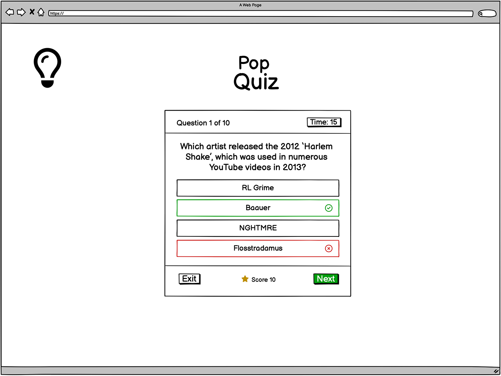
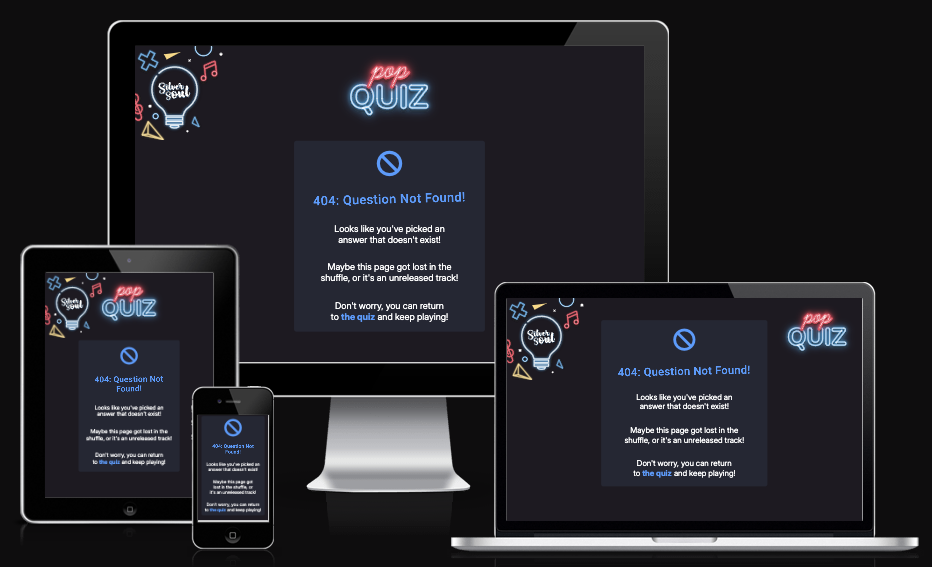
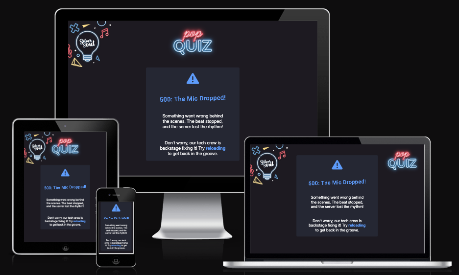

# Think you know your music?

---

Visit the deployed site here: [DJ Silver Soul's Pop Quiz](https://sd-powell.github.io/portfolio_project_2/)

## Introduction

**DJ Silver Soul Pop Quiz** is an interactive, disco-themed music trivia game designed to test and entertain players with questions about popular music from past to present.

Music quizzes enhance memory, support learning, and sharpen critical thinking. They also trigger dopamine release, improving mood and reducing stress. They also help keep the brain sharp, making them both fun and beneficial.

The game features a fast-paced multiple-choice format where players race against the clock to answer questions and secure a spot on the leaderboard. This competitive element encourages replayability, motivating players to return and beat their own high scores.

---

## CONTENTS

- [User Experience](#ux)

  - [User Stories](#user-stories)

- [Design](#Design)
  - [Colour Scheme](#colour-scheme)
  - [Typography](#typography)
  - [Imagery](#imagery)
  - [Wireframes](#wireframes)
    - [Mobile Wireframes](#mobile-frames)
    - [Tablet Wireframes](#tablet-frames)
    - [Desktop Wireframes](#desktop-frames)
      - [Features](#features)
      - [The Home Page](#home-page-features)
      - [The Rules Page](#rules-page-features)
      - [The Leaderboard Page](#leaderboard-page-features)
      - [The Difficulty Page](#difficulty-page-features)
      - [The Quiz Page](#quiz-page-features)
      - [The Results Page](#results-page-features)
      - [The 404 Page](#404-page-features)
      - [The 500 Page](#500-page-features)
      - [Future Implementations](#future-implementation)

* [Technologies Used](#technologies)

  - [Languages Used](#languages)
  - [Frameworks, Libraries & Programs Used](#frameworks)

* [Deployment & Local Development](#deployment-development)

  - [Deployment](#development)
  - [Local Development](#local-development)
    - [How to Fork](#fork)
    - [How to clone](#clone)

* [Testing](#testing-readme)

  - [Solved Issues & Bugs](#solved-issues)
  - [Know Issues & Bugs](#known-issues)

* [Credits](#credits)
  - [Inspiration](#Credits&inspiration)
  - [Content](#content)
  - [Media](#media)
  - [Acknowledgement](#acknowledgement)

---

## User Experience (UX)

The quiz is built with the player in mind, offering an engaging and immersive experience. Below are the key user-centric principles that make the game fun, intuitive, and rewarding for all music lovers:

1. **Engaging & Fun Experience** – The quiz is designed to be entertaining, immersive, and enjoyable for all music lovers
2. **Easy-to-Use Interface** – A clean, intuitive UI ensures seamless navigation and accessibility for players of all skill levels
3. **Responsive & Fast-Paced Gameplay** – Players answer multiple-choice questions against the clock, keeping the game dynamic and exciting
4. **Competitive & Replayable** – A leaderboard system encourages users to return, improve their scores, and challenge friends
5. **Interactive Feedback** – Instant response to answers (correct/incorrect) enhances the learning experience and player satisfaction
6. **Social Sharing Features** – Encourages players to share their scores and challenge friends, increasing engagement and reach
7. **Mobile-Friendly Design** – Optimized for desktop and mobile play to ensure accessibility anytime, anywhere
8. **Encourages Learning & Memory Recall** – Combining music knowledge with trivia boosts memory retention and cognitive skills

### User Stories

#### New Site Users

- As a new site user, I want to have a clear and accessible way to navigate through different sections, so that I can explore the quiz, rules, and leaderboard without difficulty.
- As a new site user, I want to understand the game rules quickly, so that I can start playing without confusion.
- As a new site user, I want to start my first quiz easily, so that I can jump straight into the fun.
- As a new site user, I want to play against a timer, so that I feel a sense of challenge and excitement while answering questions quickly.
- As a new site user, I want to see my score and progress, so that I feel motivated to improve and replay.
- As a new site user, I want to receive feedback on my answer choices, so that I can learn from my mistakes and improve my knowledge.

#### Returning Site Users

-  As a returning site user, I want the quiz experience to be consistent and function correctly across different devices, so that I can enjoy playing whether I’m on desktop, tablet, or mobile.
- As a returning site user, I want to select the difficulty level of quiz questions, so that I can tailor the challenge to my knowledge and skill level.
- As a returning site user, I want to easily restart the quiz, so that I can immediately try again if I want to improve my score.

#### Frequent Visitor Goals

- As a frequent site user, I want to see a leaderboard of top quiz scores, so that I can compare my performance with others and stay motivated to improve.
- As a frequent site user, I want to have a fair scoring system where I earn points based on correct answers, so that I feel rewarded for my knowledge and accuracy.

---

## Design

### Colour Scheme

The site's color scheme draws inspiration from the vibrant neon lights of a 1970s disco, featuring bold, electrifying hues that evoke the energy, excitement, and retro-futuristic aesthetics of the era. The glowing, high-contrast palette enhances the immersive experience, creating a visually dynamic atmosphere reminiscent of classic dance floors, shimmering reflections, and the iconic nightlife of the time.

The primary colours for the site are

To boost user engagement and draw attention to key areas, I selected distinct highlight colors that complemented the background visuals. These colors were defined as root variables in my CSS file, allowing for effortless adjustments across the site.

- `4f9aff` (Bright Blue): Used to emphasize key UI elements, drawing user focus to interactive components.
- `e83c5a` (Red): Clearly signals an incorrect answer, creating an instant visual cue for mistakes.
- `4eb738` (Green): Indicates a correct answer, reinforcing success with a positive color association.
- `f59527` (Gold): Represents the user’s score, evoking achievement and reward with a warm, celebratory tone.

This color scheme enhances clarity, feedback, and user experience while maintaining a cohesive, vibrant aesthetic.

- Toggle the arrow to view the colour swatches

### Typography

Google Fonts was used to import the selected fonts for the site, ensuring high-quality and easily accessible typography.

- **h1, h2 and h3 headings** The font [Roboto](https://fonts.google.com/specimen/Roboto?preview.text=Think%20you%20know%20your%20music%3F) was chosen because it offers a clean, modern, and highly readable design that enhances user experience while maintaining a professional and contemporary look.

- **paragraph elements:** The font [Inter](https://fonts.google.com/specimen/Inter) was chosen as a font pairing for Roboto because its geometric yet friendly design complements Roboto’s modern aesthetic, ensuring a harmonious and highly readable typography combination for my site.

- **social media icons:** [Font Awesome](https://fontawesome.com/) library icons were used throughout the site because they provide a versatile, scalable, and visually consistent icon set that enhances usability and complements the clean, modern aesthetic of my typography.

### Imagery

I chose neon imagery for my site because it’s a pop quiz, and I wanted to reflect the fun, energetic vibe of an ’80s neon disco theme. The vibrant glow and retro-futuristic aesthetic create an engaging, nostalgic atmosphere that makes the quiz experience feel exciting and immersive. All images were sourced from [Adobe Stock](https://stock.adobe.com/)

### Wireframes

Using [Balsamiq](https://balsamiq.com/), wireframes were developed for mobile, tablet, and desktop views. These wireframes played a crucial role in outlining the site’s structure and layout, ensuring a smooth user experience across different devices. The design process prioritized responsive adjustments to create an intuitive interface that adapts seamlessly to various screen sizes.

#### Mobile Wireframes

 Click here to see the Mobile Wireframes 

|                Home page wireframe                |                Rules page wireframe                 |                   Leaderboard page wireframe                    |
| :-----------------------------------------------: | :-------------------------------------------------: | :-------------------------------------------------------------: |
|  |  |  |

|                   Difficulty page wireframe                   |                Quiz page wireframe                |                 Results page wireframe                  |
| :-----------------------------------------------------------: | :-----------------------------------------------: | :-----------------------------------------------------: |
|  |  |  |

|               404 page wireframe                |               500 page wireframe                |
| :---------------------------------------------: | :---------------------------------------------: |
|  |  |

#### Tablet Wireframes

 Click here to see the Tablet Wireframes 

|                Home page wireframe                |                Rules page wireframe                 |
| :-----------------------------------------------: | :-------------------------------------------------: |
|  |  |

|                   Leaderboard page wireframe                    |                   Difficulty page wireframe                   |
| :-------------------------------------------------------------: | :-----------------------------------------------------------: |
|  |  |

|                Quiz page wireframe                |                 Results page wireframe                  |
| :-----------------------------------------------: | :-----------------------------------------------------: |
|  |  |

|               404 page wireframe                |               500 page wireframe                |
| :---------------------------------------------: | :---------------------------------------------: |
|  |  |

 

#### Desktop Wireframes

 Click here to see the Desktop Wireframes 

- Home page wireframe

- Rules page wireframe

- Leaderboard page wireframe

- Difficulty page wireframe

- Quiz page wireframe

- Results page wireframe

- 404 page wireframe

- 500 page wireframe

 

### Features

The website consists of a home page featuring a series of game panels that are dynamically shown or hidden based on the quiz stage, controlled by button interactions. Additionally, a 404 page manages invalid links, while a 500 error page is displayed if the API encounters a failure.

All Pages on the website are responsive and have:

- A favicon in the browser tab.

 Click here to view the favicon 

#### The Home Page

 Click here to view the home page 

---

The DJ Silver Soul Pop Quiz homepage is designed to provide an engaging and interactive experience for music trivia enthusiasts. Below is a breakdown of its key features and what they offer to the user:

- What it does:
  - Welcomes the user with a call-to-action: “Hit Start & Test Your Music Knowledge!”
  - Briefly explains the game’s theme and objective.
  - Encourages users to challenge themselves and aim for the leaderboard.
- User Benefits:
  - Sets an engaging and exciting tone for the quiz.
  - Clearly communicates the purpose of the game.
  - Provides a simple, intuitive starting point.
- Interactive Elements:
  - Rules Button: Allows users to read the quiz rules before playing.
  - Leaderboard Button: Gives access to the leaderboard, showing top scores.
  - Start Button: Begins the quiz immediately.

The homepage effectively sets the stage for an exciting trivia experience. With intuitive navigation, dynamic difficulty selection, and interactive quiz panels, it provides an engaging, competitive, and replayable game that caters to all music fans.

#### The Rules Page

 Click here to view the rules page 

---

- What it does:
  - Displays quiz rules in a modal window.
  - Explains gameplay mechanics, such as difficulty selection, time limits, and scoring.
  - Provides two options: Exit (back to home) or Start Quiz.
- User Benefits:
  - Ensures users understand the game mechanics before playing.
  - Helps prevent confusion about time limits and scoring.
  - Provides an easy way to return to the homepage.
- Interactive Elements:
  - Start Quiz Button: Begins the quiz immediately.
  - Exit Button: Returns the user to the home page.

#### The Leaderboard Page

 Click here to view the leaderboard page 

---

- What it does:
  - Displays the Top 10 Highest Scores.
  - Dynamically updates as new scores are submitted.
  - Provides two options:
    - Exit Button: Returns to the home page.
    - Restart Quiz Button: Starts a new quiz session.
- User Benefits:
  - Encourages competition and replayability.
  - Gives users a goal to aim for.
  - Creates an engaging social aspect by comparing scores.
- Interactive Elements:
  - Exit Button: Returns the user to the home page.
  - Restart Quiz Button: Starts a new quiz session.

#### The Difficulty Page

 Click here to view the difficulty page 

---

- What it does:
  - Allows users to select their preferred difficulty level.
  - Offers three themed difficulty levels:
    - 🎧 Easy: “The Warm-Up”
    - 🔥 Medium: “Peak Time Questions”
    - 🚀 Hard: “After Hours – For True Fans”
  - Includes an Exit Button to return to the home page.
- User Benefits:
  - Lets players customize their experience based on their skill level.
  - Adds variety and replayability.
  - Clearly explains the differences between difficulty levels.
- Interactive Elements:
  - Easy Button: Offers users easier level questions.
  - Medium Button: Offers users medium level questions.
  - Hard Button: Offers users hard level questions.
  - Exit Button: Returns the user to the home page.

#### The Quiz Page

 Click here to view the quiz page 

---

- What it does:
  - Displays trivia questions dynamically from the API.
  - Shows:
    - Question number & total questions
    - Countdown timer (15 seconds per question)
    - Four multiple-choice answer options
  - Users select an answer, and responses are immediately processed.
  - Score is updated dynamically.
- User Benefits:
  - Fast-paced, interactive gameplay keeps users engaged.
  - The countdown timer adds a challenge.
  - Immediate feedback enhances the experience.
  - The exit option ensures users have control over their session.
- Navigation buttons:
  - Exit Button: Allows users to leave at any time.
  - Next Question Button: Moves to the next question (when an answer has been selected or the timer has ended).

#### The Results Page

 Click here to view the results page 

---

- What it does:
  - Displays the user’s final score.
  - Encourages players to submit their name to the Top 10 Leaderboard.
- User Benefits:
  - Provides a satisfying conclusion to the quiz.
  - Creates motivation for users to improve their scores.
  - Allows users to replay instantly without navigating away.
- Navigation buttons:
  - Exit Button: Returns the user to the home page.
  - Restart Quiz Button: Starts a new quiz session.

#### The 404 Error Page

 Click here to view the 404 page 

---

- What it does:
  - The 404 page displays a clear and engaging message to inform users that the requested page is unavailable or does not exist.
- Navigation link:
  - A link is provided to redirect the user back to the home page.

The purpose of the 404 page is to capture any broken link errors and guide the user back to the home page.

#### The 500 Error Page

 Click here to view the 500 page 

---

- What it does:
  - The 500 error page appears when there is an issue retrieving data from the Open Trivia Database API. It displays a message informing the user of the problem and provides a link to the home page, allowing them to reload the quiz.
- Navigation link:
  - A link is provided to redirect the user back to the home page.

The purpose of the 500 page is to capture any issues with API access and guide the user back to the home page.

---

#### Future Implemetations

To ensure the website remains engaging and functional for users, in future implementations I would like to:

1. **Night & Day Mode (Manual & System-Integrated)** – Introduce a toggle feature that allows users to manually switch between light and dark mode, while also offering an auto mode that adapts based on the user’s system settings. This ensures a comfortable viewing experience in any environment, reduces eye strain, and enhances accessibility for users who prefer high-contrast or low-light displays.
2. **Lifelines / Power-Ups** – Add options like “50/50” (removes two incorrect answers), “Extra Time” (adds 5 seconds), or “Skip Question” for a more strategic experience.
3. **Additional Question Categories** – Allow users to choose different music genres (e.g., Pop, Rock, Hip-Hop, 80s Hits) instead of a single general quiz.
4. **Personalized Music Recommendations** – Based on quiz performance, suggest songs or playlists (e.g., “You scored high on Rock – check out this playlist!”).
5. **Badges & Achievements** – Reward users with unlockable badges (e.g., “Pop Quiz Champion,” “Rock Guru”) for reaching milestones.
6. **Shareable Results & Social Media Integration** – Let users share their scores on Twitter, Instagram, or Facebook.
7. **Live Leaderboard** – Introduce a live leaderboard (rather than a locally stored version) to keep competition fresh and exciting. Allowing users to compete agianst each other.

---

## Technologies Used

### Languages Used

HTML, CSS, JavaScript

### Frameworks, Libraries & Programs Used

- [Balsamiq](https://balsamiq.com/) - Used to create wireframes.

- [Adobe Illustrator](https://www.adobe.com/uk/products/illustrator.html) - Used to design the logo and create visuals.

- [Adobe Photoshop](https://www.adobe.com/uk/products/photoshop.html) - Used to crop, resize, edit and save images to webp format.

- [Git](https://git-scm.com/) - For version control.

- [Github](https://github.com/) - To save and store the files for the website.

- [Visual Studio Code](https://code.visualstudio.com/) - Code editor used to create the site.

- [Mobile First Plugin](https://www.webmobilefirst.com/en/) - Chrome plug-in used to test responsiveness of the site on different devices.

- [Responsinator](http://www.responsinator.com/) - To show the website UI on a range of devices.

- [Am I Responsive?](http://ami.responsivedesign.is/) - Another site to show the website UI on a range of devices.

- [Google Fonts](https://fonts.google.com/) - To import the fonts used on the website.

- [Font Awesome](https://fontawesome.com/) - Icon library toolkit for social media icons.

- [Google Developer Tools](https://developers.google.com/web/tools) - To troubleshoot and test features, solve issues with responsiveness and styling.

- [Aria DevTools](https://github.com/ziolko/aria-devtools) - Used to view the website the way screen readers present it to blind users.

- [Webpage Spell-Check](https://chrome.google.com/webstore/detail/webpage-spell-check/mgdhaoimpabdhmacaclbbjddhngchjik/related) - a google chrome extension that allows you to spell check your webpage. Used to check the site and the readme for spelling errors.

---

## Deployment & Local Development

### Deployment

The site is deployed using GitHub Pages - [Dj Silver Soul's Pop Quiz](https://sd-powell.github.io/portfolio_project_2/).

To Deploy the site using GitHub Pages:

1. Login (or signup) to Github.
2. Go to the repository for this project, [sd-powell/portfolio_project_2](https://github.com/sd-powell/portfolio_project_2).
3. Click the settings button.
4. Select pages in the left hand navigation menu.
5. From the source dropdown select main branch and press save.
6. The site has now been deployed, please note that this process may take a few minutes before the site goes live.

### Local Development

#### How to Fork

To fork the repository:

1. Log in (or sign up) to Github.
2. Go to the repository for this project, [sd-powell/portfolio_project_2](https://github.com/sd-powell/portfolio_project_2).
3. Click the Fork button in the top right corner.

#### How to Clone

To clone the repository:

1. Log in (or sign up) to GitHub.
2. Go to the repository for this project, [sd-powell/portfolio_project_2](https://github.com/sd-powell/portfolio_project_2).
3. Click on the code button, select whether you would like to clone with HTTPS, SSH or GitHub CLI and copy the link shown.
4. Open the terminal in your code editor and change the current working directory to the location you want to use for the cloned directory.
5. Type 'git clone' into the terminal and then paste the link you copied in step 3. Press enter.

---

## Testing

> [!NOTE]
> Please refer to [TESTING.md](TESTING.md) file for all testing carried out.

### Solved Issues & Bugs

| No | Bug Description | Solution | Screenshot |
| :- | :------------- | :-------- | :--------- |
| 1  | When testing the HTML code with the W3C validator, it flagged an issue with trailing slashes (e.g., ` `). This was caused by the formatter in VS Code. | I disabled "Format on Save" in VS Code to resolve the issue and re-tested my HTML code. |  |
| 2  | When a user leaves the name field blank or enters only spaces before submitting, Chrome displays its default alert: `"Please enter your name before submitting!"`. My mentor suggested replacing this with a JavaScript alert using [SweetAlert2](https://sweetalert2.github.io/). | I installed the SweetAlert2 CDN link and implemented a custom alert modal. |  |
| 3  | When testing the site on small screens (320px wide), part of the main panel was cropped by the viewport. | I added a media query `@media screen and (max-width: 320px) and (max-height: 568px)`, which removed the background image and repositioned the panel at the top of the screen. |  |
| 4  | In my first project, I realised that I didn't implement ARIA labels for my background images. | I researched how to add ARIA labels to the `<header>` element, ensuring they appeared correctly in the ARIA testing tool I used. |  |

---

### Known Issues & Bugs

I’ve realized that most images on my site are set as background images, making it difficult to provide descriptive alt text for screen readers. This could affect accessibility for visually impaired users. Moving forward, I plan to explore alternative ways to incorporate images to improve accessibility and align with web standards.

---

## Credits & Inspiration

- This [YouTube tutorial](https://www.youtube.com/watch?v=xZXW5SnCiWI&t=2918s) was incredibly helpful in shaping the key features of my quiz. It provided valuable insights into concepts like hiding and displaying panels, implementing a timer, and showing correct and incorrect answers after a response. These elements not only enhanced my understanding but also gave me the confidence to develop my own features.

- Additionally, I watched [This YouTube tutorial](https://www.youtube.com/watch?v=UY6AeR_M_dU) to learn how to use the [Open Trivia API](https://opentdb.com/) in my project.

- I drew inspiration from [MyFitnessPal](https://www.myfitnesspal.com/) for the site’s color scheme and interface design.

- This post on [Stack Overflow](https://stackoverflow.com/questions/24127507/is-it-possible-to-center-tables-in-a-markdown-file) helped me to understand markdown tables and positioning.

### Content

Every question on my site was sourced via the API from [The Open Trivia Database](https://opentdb.com/).

All other content for the site is written by myself.

### Media

- [Adobe Stock](https://stock.adobe.com/) - Used to source royalty free imagery for the site.

### Acknowledgments

I would like to acknowledge the following people:

- [Jubril Akolade](https://github.com/Jubrillionaire) - My Code Institute Mentor.

- Ax de Klerk, Jordan Acomba & Robert Lewis - My fellow Code Institute cohort, who helped each other over the course of our milestone projects.

- The quiz fans in my family for helping me test my site.

- The Code Institute Slack channel Peer Code Review - Thank you to everyone who took the time to view my site and look over the code.

 

[🔼 Back to top](#contents)