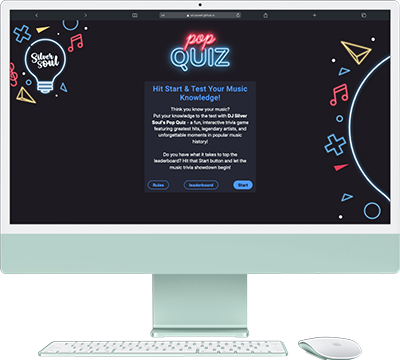
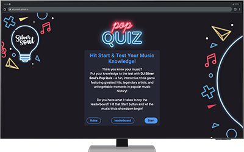
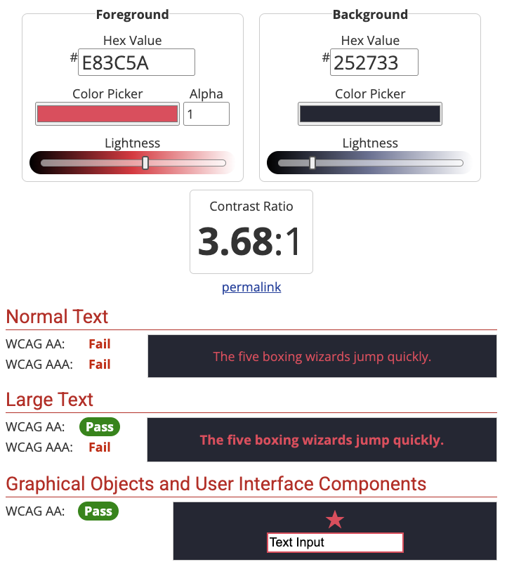
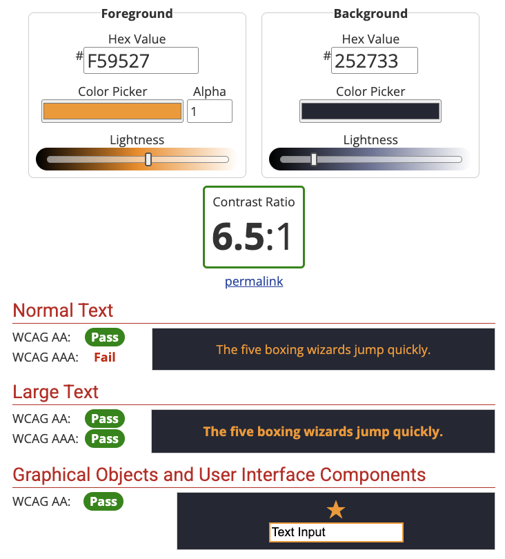
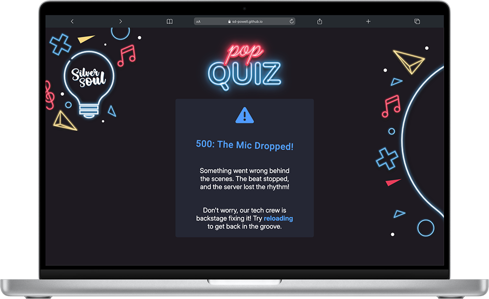
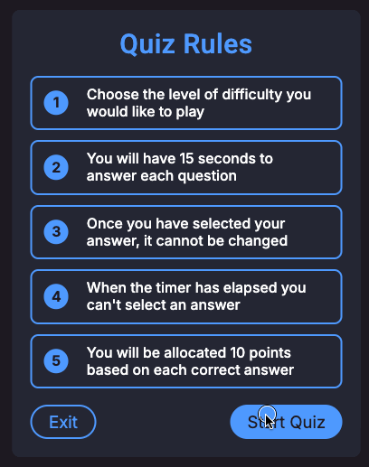
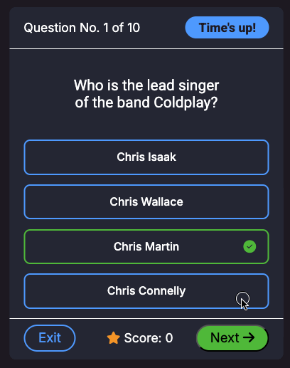
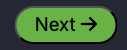

# Testing

Visit the deployed site here: [DJ Silver Soul's Pop Quiz](https://sd-powell.github.io/portfolio_project_2/)

> [!NOTE]  
> Return back to the [README.md](README.md) file.

This document outlines the testing processes and results for the **DJ Silver Soul Pop Quiz**. It ensures that all features function as expected, meet accessibility standards, and provide an optimal user experience.

---

## CONTENTS

- [AUTOMATED TESTING](#automated-testing)
  - [W3C Validator](#w3c-validation)
  - [W3C CSS Validator](#css-validation)
  - [JavaScript Validator](#js-validation)
  - [Lighthouse](#lighthouse)
- [MANUAL TESTING](#manual-testing)
  - [Full Testing](#full-testing)
  - [Browser Compatibility](#browser)
  - [Responsiveness](#responsiveness)
  - [Accessibility](#accessibility)
  - [Testing User Stories](#testing-user)
  - [Features Testing](#features-test)
  - [Existing Features](#existing-features)
  - [Manual Features Testing](#manual-features-test)

 

Testing was an **integral part of the development process**, ensuring the website remained both **functional and user-friendly** at every stage. By conducting **continuous testing**, potential issues were identified early, allowing for swift resolution and a more efficient workflow.

**Chrome Developer Tools** played a crucial role throughout development, providing real-time insights into performance, responsiveness, and debugging. This proactive approach helped streamline development and ensure the final product adhered to high-quality standards.

Additionally, **ChatGPT** served as a key resource for refining ideas, optimizing content, and overcoming technical challenges. By offering structured guidance, best practices, and alternative solutions, it contributed to improving both the efficiency of development and the overall quality of the final product.

To guarantee **cross-device compatibility**, every page was rigorously tested across various **screen sizes and devices** using Chrome Developer Tools. This process ensured the quiz was fully responsive, providing a seamless user experience across **desktops, tablets, and mobile devices**.

---

## AUTOMATED TESTING

### W3C Validator

[W3C](https://validator.w3.org/) was used to validate the HTML on all pages of the website.

| Directory | File tested | Screenshot | Notes |
| --------- | ----------- | ---------- | ----- |
| documentation/testing-w3c-home.webp | index.html |  | no errors occurred when checking |
| documentation/testing-w3c-404.webp | 404.html |  | no errors occurred when checking |
| documentation/testing-w3c-500.webp | 500.html |  | no errors occurred when checking |

---

### CSS Validator

[CSS W3C Validator](https://jigsaw.w3.org/css-validator/) was used to validate my CSS file.

| Directory                                | File tested  | Screenshot                                              | Notes                            |
| ---------------------------------------- | ------------ | ------------------------------------------------------- | -------------------------------- |
| documentation/testing-w3css-home.webp | style.css    |  | no errors occurred when checking |

### JavaScript Validator

The [JSHint](https://jshint.com/) website was used to validate the JavaScript code. I also installed [ESLint](https://eslint.org/) in [VS Code](https://code.visualstudio.com/), which automatically checked my JavaScript code in the console and reported any errors.  

I attempted to test with [Jest](https://jestjs.io/) and [Cypress](https://www.cypress.io/), but I encountered complications when importing functions into my test scripts. After assessing the time required to resolve these issues, I decided it would be more efficient to use alternative testing methods.

| Validator| Issues found | Fix Implemented |
| :--: | :-- | :-- |
| **JSHint** | One warning `117	'async functions' is only available in ES8 (use 'esversion: 8').` | JSHint is warning you that async functions are only supported in ES8 (ECMAScript 2017), but it is currently set to an older ECMAScript version. I updated the JSHint configuration to ES8. |
| **ESLint** | One error `297:5 error 'Swal' is not defined no-undef` | I researched this issue on [GitHub](https://github.com/sweetalert2/sweetalert2/issues/477) and it should be resolved by declaring the link to the sweetalert2 CDN in `ìndex.html` |

### Lighthouse

I've tested my deployed project using the Lighthouse Audit tool to test the performance, accessibility, best practices and SEO of the website.

| Page | Mobile | Desktop | Notes |
| :--: | :--: | :--: | :--: |
| Home |  |  | ✅ Passed with great results |
| 404 |  |  | ✅ Passed with great results |
| 500 |  |  | ✅ Passed with great results |

---

## MANUAL TESTING

### Full Testing

This section outlines the manual testing process conducted to ensure the website functions correctly across different devices, screen sizes, and user interactions. Each test was performed methodically to identify potential issues with responsiveness, usability, and accessibility, with results documented for further improvements. Additional testing was taken by friends and family on a variety of devices and screen sizes.

---

### Browser Compatibility

- [Safari](https://www.apple.com/uk/safari/)
- [Chrome](https://www.google.com/chrome)
- [Firefox](https://www.mozilla.org/firefox)
- [Bing](https://www.bing.com/)
- [Edge](https://www.microsoft.com/en-gb/edge?form=MA13FJ)

I tested my deployed project on multiple browsers to check for compatibility issues.

---

### Responsiveness

In addition to testing my deployed site on different devices, I thoroughly tested its responsiveness using Chrome Developer Tools.  
I researched the **narrowest width of modern devices** on [Stack Exchange](https://ux.stackexchange.com/questions/74798/are-there-devices-narrower-than-320px-and-data-on-their-usage-for-web-browsing) and based my testing on **320px** as a standard minimum width.  
Additionally, I used the [Mobile First Plugin](https://www.webmobilefirst.com/en/), a Chrome extension designed to test site responsiveness across different devices.

#### Mobile Devices

| Device tested | Screen Width (px) | Screen Height (px) | Result | Notes (Issues Found) |
| :---: | :---: | :---: | :---: | :---: |
| iPhone 5  | iPhone 12/13/14  | Google Pixel 8  | iPhone 16 Pro Max  |
| iPhone 5 | 320px | 568px | ✅ Pass | 🛠️ Removed background image and filled screen with panel |
| iPhone 12/13/14 | 390px | 844px | ✅ Pass | |
| Google Pixel 8 | 412px | 916px | ✅ Pass | |
| iPhone 16 Pro Max | 440px | 956px | ✅ Pass | |

#### Tablets

| Device tested | Screen Width (px) | Screen Height (px) | Result | Notes (Issues Found) |
| :---: | :---: | :---: | :---: | :---: |
| iPad Mini  | Galaxy Tab S7  | | | |
| iPad Mini | 768px | 1024px | ✅ Pass |  |
| Galaxy Tab S7 | 800px | 1280px | ✅ Pass |  |

#### Laptops & Desktops

| Device tested | Screen Width (px) | Screen Height (px) | Result | Notes (Issues Found) |
| :---: | :---: | :---: | :---: | :---: |
| MacBook Air 13”  | Dell Latitude  | Macbook Pro 16"  | iMac 24"  | Full HD monitor  |
| MacBook Air 13” | 1280px | 800px | ✅ Pass | ✅ Fully responsive |
| Dell Latitude | 1440px | 809px | ✅ Pass | ✅ Fully responsive |
| Macbook Pro 16" | 1728px | 1085px | ✅ Pass | ✅ Fully responsive  🛠️ Added additional graphic to fill blank space on larger screens|
| iMac 24" | 2048px | 1142px | ✅ Pass | ✅ Fully responsive  🛠️ Added additional graphic to fill blank space on larger screens|
| Full HD monitor | 1920px  | 1080px | ✅ Pass | ✅ Fully responsive  🛠️ Added additional graphic to fill blank space on larger screens|

---

### Accessibility

#### Colour contrast compliance

In addition to the automated tests for accessibility standards, I used [WebAIM](https://webaim.org/resources/contrastchecker/) to test the contrast of the colours on the site for visually impaired users.

| Foreground colour | Background colour | Screenshot | Testing results |
| :-----------------: | :-----------------: | :---------------: | :---------------: |
| `#ffffff`         | `#252733`         | | ✅ Pass |
| `#151724`         | `#4f9aff`         | | ⛔️ Fail on small text   ✅  Pass on larger text and graphics |
| `#4eb738`         | `#252733`         | | ⛔️ Fail on small text   ✅  Pass on larger text and graphics |
| `#e83c5a`         | `#252733`         | | ⛔️ Fail on all text   ✅  Pass on graphics |
| `#f59527`         | `#252733`         | | ⛔️ Fail on small text   ✅  Pass on larger text and graphics |

---

---

### Testing User Stories

#### First Time Visitors

| Goals | How were they achieved? |
| ------ | -------------------------- |
| **As a new site user, I want to have a clear and accessible way to navigate through different sections, so that I can explore the quiz, rules, and leaderboard without difficulty.** | The homepage panel provides clear **buttons for Rules, Leaderboard, and Start Quiz**. All buttons include **ARIA labels for accessibility**. |
| **As a new site user, I want to understand the game rules quickly, so that I can start playing without confusion.** | The **Rules Panel** presents a **structured ordered list** outlining quiz mechanics clearly, ensuring quick comprehension. The "Start Quiz" button allows easy transition after reading. |
| **As a new site user, I want to start my first quiz easily, so that I can jump straight into the fun.** | The homepage panel includes a **"Start" button**, which immediately takes users to the **Difficulty Selection Panel**, making the onboarding process seamless. |
| **As a new site user, I want to play against a timer, so that I feel a sense of challenge and excitement while answering questions quickly.** | Each question displays a **15-second countdown timer**. The **progress bar visually indicates time left**, and expired time prevents further answer selection. |
| **As a new site user, I want to see my score and progress, so that I feel motivated to improve and replay.** | The quiz footer **displays the current score dynamically** as questions are answered. The **Results Panel** shows the final score, encouraging replay. |
| **As a new site user, I want to receive feedback on my answer choices, so that I can learn from my mistakes and improve my knowledge.** | Selected answers are **highlighted as correct or incorrect**, reinforcing learning. Incorrect answers **cannot be changed**, ensuring fair gameplay. |

#### Returning Visitors

| Goals | How were they achieved? |
| ------ | -------------------------- |
| **As a returning site user, I want the quiz experience to be consistent and function correctly across different devices, so that I can enjoy playing whether I’m on desktop, tablet, or mobile.** | The site uses a **responsive design** that adapts to different screen sizes. All interactive elements remain **functional and accessible** on various devices. |
| **As a returning site user, I want to select the difficulty level of quiz questions, so that I can tailor the challenge to my knowledge and skill level.** | The **Difficulty Panel** provides **three difficulty options** that allow users to choose their preferred level. The choice is stored and applied to the quiz. |
| **As a returning site user, I want to easily restart the quiz, so that I can immediately try again if I want to improve my score.** | The **Results Panel** includes a **"Restart Quiz" button**, allowing users to replay instantly without navigating back to the homepage. |

#### Frequent Site Visitors

| Goals | How were they achieved? |
| ------ | -------------------------- |
| **As a frequent site user, I want to see a leaderboard of top quiz scores, so that I can compare my performance with others and stay motivated to improve.** | The **Leaderboard Panel** dynamically updates with the **top 10 scores**. Users can submit their name and see their ranking after completing a quiz. |
| **As a frequent site user, I want to have a fair scoring system where I earn points based on correct answers, so that I feel rewarded for my knowledge and accuracy.** | The **scoring system awards 10 points per correct answer**, ensuring fairness. The score **updates in real-time** during the quiz and is accurately recorded. |

---

## Features Testing

### Existing Features

### Home Page Panel

#### Overview
The **Home Page Panel** serves as the entry point for the DJ Silver Soul Pop Quiz, introducing users to the game and providing navigation options to key sections. It ensures a smooth onboarding experience while maintaining a visually engaging and accessible design.

#### Features Tested:
- **Introduction & Engagement:**  
  - The panel presents a **clear and engaging welcome message** that highlights the quiz's theme and challenge.  
  - The description uses **bold text (`<strong>`)** to emphasize key points like the quiz title and leaderboard competition.  
  - The message is **formatted properly**, ensuring readability across different devices.  

- **Navigation & Call to Action:**  
  - The **"Rules" button (`#rules_btn`)** correctly navigates users to the rules panel.  
  - The **"Leaderboard" button (`#leaderboard_btn`)** allows users to view the top scores.  
  - The **"Start" button (`#start_btn`)** initiates the quiz and smoothly transitions users into the game.  
  - **ARIA labels** are applied to all buttons for improved accessibility.  

- **Branding & Design:**  
  - The **site’s branding is consistently maintained**, with a fun and engaging theme.  
  - The **layout is structured for easy interaction**, ensuring a smooth user experience.  
  - The **buttons are clearly labeled** and appropriately styled, making navigation intuitive.  

- **Responsiveness & Accessibility:**  
  - The home page panel adapts well to **various screen sizes** (desktop, tablet, mobile).  
  - The **buttons are keyboard-navigable**, ensuring usability for all users.  
  - **Semantic HTML elements** (`<h2>`, `
`, `<button>`) enhance screen reader compatibility.  

- **Performance & Functionality:**  
  - The **home page panel loads quickly**, with no missing or broken elements.  
  - The **buttons work correctly**, allowing users to navigate between sections without errors.  
  - The interface ensures that **users cannot start the quiz without first engaging with the home panel**.  

Click here to see the Home Page Panel

 

### Rules Panel

#### Overview
The **Rules Panel** provides users with clear and concise guidelines on how the quiz functions before they begin. It ensures players understand the gameplay mechanics, scoring system, and time constraints while maintaining an intuitive and accessible layout.

#### Features Tested:
- **Rules Display & Readability:**  
  - The panel correctly presents **five key quiz rules** in an ordered list (`<ol>`).  
  - The rules are structured for **easy reading** and clearly outline:  
    - Difficulty selection  
    - Time limits for answering (`15 seconds per question`)  
    - Answer selection restrictions  
    - Scoring system (`10 points per correct answer`)  
  - The text is **formatted properly** to maintain readability on different devices.  

- **Navigation & Call to Action:**  
  - The **"Start Quiz" button (`#rules_start_btn`)** begins the quiz and transitions users smoothly.  
  - The **"Exit" button (`#exit_btn`)** allows users to return to the home page.  
  - **ARIA labels** are applied to all buttons for improved accessibility.  

- **Branding & Design:**  
  - The rules panel follows the **consistent styling of the site**, ensuring visual uniformity.  
  - The **button layout is intuitive**, with "Exit" and "Start Quiz" options clearly defined.  
  - The structured **ordered list (`<ol>`)** ensures proper formatting across devices.  

- **Responsiveness & Accessibility:**  
  - The panel scales properly across **various screen sizes** (desktop, tablet, mobile).  
  - The **buttons are keyboard-navigable**, ensuring accessibility for all users.  
  - **Semantic HTML elements** (`<h2>`, `<ol>`, `<li>`, `<button>`) improve screen reader support.  

- **Performance & Functionality:**  
  - The **rules panel loads quickly**, with no broken elements or missing content.  
  - The **"Start Quiz" button** correctly transitions users into the quiz.  

Click here to see the Rules Panel

 

### Difficulty Panel

#### Overview
The **Difficulty Panel** allows users to select their preferred quiz difficulty level before starting the game. The panel presents a fun, engaging theme while ensuring smooth interaction and navigation.

#### Features Tested:
- **Difficulty Selection Functionality:**  
  - Users can select one of **three difficulty levels**:  
    - 🎧 **Easy Listening** - "The warm-up" (`#easy`)  
    - 🔥 **Medium** - "Peak Time questions" (`#medium`)  
    - 🚀 **Hard** - "After hours - for true fans" (`#hard`)  
  - The correct difficulty selection is stored and passed to the quiz logic.  
  - Only **one difficulty option can be selected at a time**.  

- **Navigation & Call to Action:**  
  - The **"Exit" button (`#diff_exit_btn`)** returns users to the home page.  
  - **ARIA labels** are applied to all buttons for better accessibility.  
  - The panel ensures users **cannot proceed without selecting a difficulty level**.  

- **Branding & Design:**  
  - The panel follows the **site’s music-themed branding**, with engaging descriptions and icons.  
  - The **buttons are well-spaced and clearly labeled**, making selection easy.  
  - The interface maintains a **fun, inviting experience** that aligns with the quiz’s theme.  

- **Responsiveness & Accessibility:**  
  - The difficulty panel **scales properly** on different screen sizes (desktop, tablet, mobile).  
  - The **buttons are keyboard-navigable**, ensuring accessibility for all users.  
  - The use of **semantic HTML elements** (`<h2>`, `
`, `<button>`) supports screen reader functionality.  

- **Performance & Functionality:**  
  - The **difficulty selection buttons** work as expected and apply the correct settings.  
  - The **panel loads efficiently**, with no broken styling or layout issues.  
  - The interface prevents users from **accidentally skipping difficulty selection** before starting the quiz.  

Click here to see the Difficulty Panel

 

### Quiz Panel

#### Overview
The **Quiz Panel** provides an interactive interface for users to answer music-related questions. It dynamically updates the question, tracks the timer, manages user responses, and displays the current score. The panel ensures a smooth and engaging quiz experience.

#### Features Tested:
- **Question Display & Dynamic Updates:**  
  - The **question number (`#questionNo`)** correctly increments as users progress through the quiz.  
  - Questions and answer choices are **dynamically loaded from an API** and update correctly.  
  - The **selected answer buttons (`.answer_btn`)** register clicks and validate responses appropriately.  

- **Timer Functionality:**  
  - The **quiz timer (`#timer_secs`)** starts at 15 seconds and counts down correctly and displays "Time's Up" when it ends.  
  - The **progress bar (`.time_line`)** updates visually as time decreases.  
  - If time expires, the quiz correctly **prevents further answer selection** and moves to the next question.  

- **Answer Selection & Feedback:**  
  - The **answer buttons (`.answer_btn`)** highlight correct or incorrect responses.  
  - Once an answer is chosen, **users cannot change their selection** before the next question appears.  
  - The system registers correct answers and updates the **score (`#score_total`)** dynamically by 10 points per correct answer.  

- **Navigation & Call to Action:**  
  - The **"Next" button (`#next_btn`)** only becomes available after a user selects an answer or the timer runs out.  
  - The **"Exit" button (`#quiz_exit_btn`)** correctly navigates back to the home page.  
  - **ARIA labels** are used on buttons for better accessibility.  

- **Score Tracking & Display:**  
  - The **score section (`.quiz_score`)** updates after each question.  
  - Users receive immediate feedback on their **current score (`#score_total`)**.  
  - The game ensures **accurate tracking of correct answers** throughout the session.  

- **Branding & Design:**  
  - The quiz panel maintains a **consistent theme and visual design** with the rest of the site.  
  - The layout is structured for **easy readability and user engagement**.  
  - The **use of icons (`fa-solid fa-star` for scores, `fa-solid fa-arrow-right` for next question)** enhances the UI experience.  

- **Responsiveness & Accessibility:**  
  - The quiz adapts well to **different screen sizes** (desktop, tablet, mobile).  
  - The **buttons are keyboard-navigable**, allowing non-mouse users to interact with the quiz.  
  - **Semantic HTML elements** (`<h2>`, `
`, `<button>`) improve screen reader support.  

- **Performance & Functionality:**  
  - The quiz **loads questions efficiently** without delays or broken elements.  
  - Users **cannot proceed to the next question** without answering or the timer expiring.  
  - The **quiz handles incorrect or missing API data gracefully** without breaking functionality.  

Click here to see the Quiz Panel

 

### Results Panel

#### Overview
The **Results Panel** provides users with a summary of their quiz performance, displaying their final score and offering them the chance to submit their name to the leaderboard. It also includes navigation options to restart the quiz or exit to the home page.

#### Features Tested:
- **Score Display & Feedback:**  
  - The panel **correctly displays** the user’s final score within the ``.  
  - A motivational message is included, reinforcing engagement with **"Top of the Pops"** encouragement.  

- **Leaderboard Submission Functionality:**  
  - The **name input field (`#user_name`)** allows users to enter a name (up to 20 characters).  
  - The form enforces **input validation**, preventing blank or whitespace-only submissions (`pattern="\S(.*\S)?" required`).  
  - The **"Submit" button (`#submit_score`)** correctly registers the name and score in the leaderboard.  

- **Navigation & Call to Action:**  
  - The **"Exit" button (`#quit_quiz`)** returns users to the home page.  
  - The **"Restart Quiz" button (`#restart_quiz`)** allows users to start a new quiz session instantly.  
  - **ARIA labels** are applied to buttons for improved accessibility.  

- **Branding & Design:**  
  - The panel maintains a **consistent visual style** with the rest of the site.  
  - The **input field and buttons** are clearly distinguishable and properly styled.  
  - The layout is structured to ensure easy readability and interaction.  

- **Responsiveness & Accessibility:**  
  - The results panel adapts well to different **screen sizes** (desktop, tablet, mobile).  
  - The **form elements (`<input>`, `<button>`)** are accessible via keyboard navigation and screen readers.  
  - The use of **semantic HTML elements** (`<h2>`, `
`, `<form>`, `<input>`, `<button>`) enhances accessibility.  

- **Performance & Functionality:**  
  - The **score updates dynamically** upon quiz completion.  
  - The **submission form works correctly**, preventing invalid inputs and successfully adding scores to the leaderboard.  
  - The page loads **efficiently** without broken elements or layout shifts.  

Click here to see the Results Panel

 

### Leaderboard Panel

#### Overview
The **Leaderboard Panel** provides users with a ranked list of the top 10 scores, dynamically updating based on quiz performance. It enhances user engagement by displaying competitive scores and offering options to restart or exit the quiz.

#### Features Tested:
- **Leaderboard Display & Dynamic Updates:**  
  - The **top 10 scores** are displayed in a structured table format.  
  - The `<tbody>` section dynamically updates with user scores after quiz completion.  
  - **Ranks, names, and scores** are correctly displayed in descending order.  

- **Navigation & Call to Action:**  
  - The **"Exit" button** allows users to return to the home page.  
  - The **"Restart Quiz" button** lets users immediately begin a new quiz session.  
  - **ARIA labels** are applied to buttons for improved accessibility.  

- **Branding & Design:**  
  - The panel maintains the **consistent styling** of the site.  
  - Uses **clear, readable fonts** and a structured table format for clarity.  
  - Buttons follow the **expected UI conventions** (`outline_btn` for exit, `reverse_btn` for restart).  

- **Responsiveness & Accessibility:**  
  - The leaderboard layout adapts to different **screen sizes** (desktop, tablet, mobile).  
  - Uses **semantic HTML elements** (`<table>`, `<th>`, `<tbody>`) to ensure proper screen reader support.  
  - Button labels and interactive elements comply with **ARIA accessibility guidelines**.  

- **Performance & Functionality:**  
  - The leaderboard updates **instantly** after the quiz is completed.  
  - The **Exit and Restart buttons** work as expected, redirecting users appropriately.  
  - The page loads **without delays or broken styling**, ensuring a smooth user experience.  

Click here to see the Leaderboard Panel

 

### 404 Page

#### Overview
The **404 Page Not Found** error page provides a fun and engaging experience for users who land on a non-existent or unavailable page. It embraces the **musical quiz theme** by presenting a playful message that keeps users entertained while guiding them back to the quiz.

#### Features Tested:
- **Clear & Engaging Messaging:**  
  - The page displays a **music-themed error message**: *"404: Question Not Found!"*  
  - The wording aligns with the **pop quiz theme**, making the experience more engaging.  
  - Avoids overly technical language and reassures users they can easily navigate back.

- **Navigation & Call to Action:**  
  - Provides a **link back to the quiz homepage** to ensure users can quickly resume their session.  
  - Uses an **ARIA label** for accessibility, ensuring screen readers describe the link clearly.  
  - Prevents users from feeling "stuck" by offering a clear way forward.

- **Branding & Design:**  
  - Maintains **branding consistency** with the rest of the website.  
  - Features an **error icon (fa-solid fa-ban)** to visually indicate an issue.  
  - Uses a **friendly, playful tone** that aligns with the quiz experience.
  - Includes a **CSS keyframe animation** applied to the `<h2>` element to create a subtle shake effect, reinforcing the idea of an "error" or "glitch."  
  - The animation enhances user engagement without being distracting.  

- **Responsiveness & Accessibility:**  
  - The page adapts well to different **screen sizes** and devices (desktop, tablet, mobile).  
  - Uses **semantic HTML** (e.g., `<h2>` for headings, `
` for descriptions) to enhance readability.  
  - ARIA labels improve usability for **assistive technologies**, ensuring smooth navigation.  

- **Performance & Functionality:**  
  - The **homepage link** works correctly and redirects users back to the quiz.  
  - The page **loads quickly**, even if the requested URL does not exist.  
  - The **error icon and text display correctly** without any layout shifts or broken styling.  

Click here to see the 404 page

 

### 500 Page

#### Overview
The **500 Internal Server Error page** provides a fun, engaging message that reassures users when a server-side issue occurs. It maintains a **musical theme** that aligns with the site’s branding while guiding users toward possible solutions.

#### Features Tested:
- **Clear & Engaging Messaging:**  
  - The page presents a humorous and **on-brand error message**: *"The beat stopped, and the server lost the rhythm!"*  
  - Avoids technical jargon and reassures users that the issue is being addressed.

- **Navigation & Call to Action:**  
  - Provides a **reload option** to encourage users to retry accessing the site.  
  - Includes a **link back to the homepage** for easy recovery.  
  - Uses **ARIA labels** to enhance accessibility for screen readers.

- **Branding & Design:**  
  - Maintains the **musical theme** with a relevant message.  
  - Uses an **error icon (fa-solid fa-triangle-exclamation)** to visually indicate an issue.  
  - Consistent color scheme and typography ensure a seamless user experience.
  - Includes a **CSS keyframe animation** applied to the `<h2>` element to create a subtle shake effect, reinforcing the idea of an "error" or "glitch."  
  - The animation enhances user engagement without being distracting.

- **Responsiveness & Accessibility:**  
  - The page adapts well to different **screen sizes** and devices (desktop, tablet, mobile).  
  - Uses **semantic HTML** (e.g., `<h2>` for headings, `
` for descriptions) for better readability.  
  - ARIA labels improve usability for **assistive technologies**.

- **Performance & Functionality:**  
  - The **homepage link** and **reload option** function as expected.  
  - The page **loads quickly**, even during server issues.  
  - The **error icon and text display correctly** without layout shifts.

Click here to see the 500 page

 

## Manual Features Testing

### Home Page

| Component | Expected Behavior | Testing Steps | Actual Result | Fix (if needed) | Screenshot |
| --- | --- | --- | --- | --- | --- |
| **Rules** button | The **rules** panel should open, displaying instructions on how to play the quiz | Clicked on the **rules** button | The **rules** panel opened and displayed the instructions correctly | ✅ No fix needed |  |
| **Leaderboard** button | The **leaderboard** panel should open and display the top 10 scores, ranked by position, player name, and score | Clicked on the **leaderboard** button | The **leaderboard** panel opened and displayed the top 10 scores correctly | ✅ No fix needed |  |
| **Start** button | The **difficulty** panel should open, displaying three buttons that allow the user to choose between *Easy*, *Medium*, or *Hard* quiz questions | Clicked on the **Start** button | The **difficulty** panel opened and displayed the three difficulty buttons | ✅ No fix needed |  |
| **Rules** and **Leaderboard** buttons - hover effect | When hovered over, the **Rules** and **Leaderboard** buttons should change to a white background with light blue text | Hovered over the **Rules** and **Leaderboard** buttons | The **Rules** and **Leaderboard** buttons changed to a white background with light blue text when hovered over | ✅ No fix needed |     |
| **Start** button - hover effect | When hovered over, the **Start** button should change from dark blue text to white text | Hovered over the **Start** button | The **Start** button changed from dark blue text to white text when hovered over | ✅ No fix needed |   |

---

### Quiz Rules Page

| Component | Expected Behavior | Testing Steps | Actual Result | Fix (if needed) | Screenshot |
| --- | --- | --- | --- | --- | --- |
| **Exit** button | The **rules** panel should close, revealing the home page panel | Clicked on the **Exit** button | The **rules** panel closed, and the home page panel was revealed | ✅ No fix needed |  |
| **Start Quiz** button | The **difficulty** panel should open, displaying three buttons that allow the user to choose between *Easy*, *Medium*, or *Hard* quiz questions | Clicked on the **Start Quiz** button | The **difficulty** panel opened and displayed the three difficulty buttons | ✅ No fix needed |  |
| **Exit** button - hover effect | When hovered over, the **Exit** button should change to a white background with light blue text | Hovered over the **Exit** button | The **Exit** button changed to a white background with light blue text when hovered over | ✅ No fix needed |   |
| **Start Quiz** button - hover effect | When hovered over, the **Start** button should change from dark blue text to white text | Hovered over the **Start** button | The **Start** button changed from dark blue text to white text when hovered over | ✅ No fix needed |   |

---

### Leaderboard Page

| Component | Expected Behavior | Testing Steps | Actual Result | Fix (if needed) | Screenshot |
| --- | --- | --- | --- | --- | --- |
| **Exit** button | The **leaderboard** panel should close, revealing the **home page** panel | Clicked on the **Exit** button | The **leaderboard** panel closed, and the **home page** panel was revealed | ✅ No fix needed |  |
| **Restart Quiz** button | The **difficulty** panel should open, displaying three buttons that allow the user to choose between *Easy*, *Medium*, or *Hard* quiz questions | Clicked on the **Restart Quiz** button | The **difficulty** panel opened and displayed the three difficulty buttons | ✅ No fix needed |  |
| **Scores** are displayed | If the user achieves and submits a score that ranks within the top ten of previously submitted scores, it should be displayed in the  **leaderboard** table | Played the quiz and aimed to beat the lowest score in the current **leaderboard** | The highest scores in the top ten were successfully submitted and displayed in the **leaderboard** table | ✅ No fix needed | 
| **Exit** button - hover effect | When hovered over, the **Exit** button should change to a white background with light blue text | Hovered over the **Exit** button | The **Exit** button changed to a white background with light blue text when hovered over | ✅ No fix needed |   |
| **Restart Quiz** button - hover effect | When hovered over, the **Restart Quiz** button should change from dark blue text to white text | Hovered over the **Restart Quiz** button | The **Restart Quiz** button changed from dark blue text to white text when hovered over | ✅ No fix needed |   |

---

### Difficulty Page

| Component | Expected Behavior | Testing Steps | Actual Result | Fix (if needed) | Screenshot |
| --- | --- | --- | --- | --- | --- |
| **Easy** button | The **difficulty** panel should close, revealing the **Quiz** panel. The API should be called using the easy quiz URL | Clicked on the **Easy** button | The **difficulty** panel closed, the **Quiz** panel opened. The API call was logged to the console | ✅ No fix needed |  |
| **Medium** button | The **difficulty** panel should close, revealing the **Quiz** panel. The API should be called using the medium quiz URL | Clicked on the **Medium** button | The **difficulty** panel closed, the **Quiz** panel opened. The API call was logged to the console | ✅ No fix needed |  |
| **Hard** button | The **difficulty** panel should close, revealing the **Quiz** panel. The API should be called using the hard quiz URL | Clicked on the **Hard** button | The **difficulty** panel closed, the **Quiz** panel opened. The API call was logged to the console | ✅ No fix needed |  |
| **Exit** button | The **difficulty** panel should close, revealing the **home page** panel | Clicked on the **Exit** button | The **difficulty** panel closed, and the **home page** panel was revealed | ✅ No fix needed |  |
| **Difficulty** buttons - hover effect | When hovered over, the **difficulty** buttons should change from a dark blue background to a light blue background | Hovered over each **difficulty** button | The **difficulty** buttons changed from a dark blue background to a light blue background when hovered over | ✅ No fix needed |  |
| **Exit** button - hover effect | When hovered over, the **Exit** button should change to a white background with light blue text | Hovered over the **Exit** button | The **Exit** button changed to a white background with light blue text when hovered over | ✅ No fix needed |   |

### ⛔️ Difficulty Page - Negative Testing Scenarios

| Component | Expected Behavior | Negative Test Performed | Actual Result | Fix (if needed) | Screenshot |
| --- | --- | --- | --- | --- | --- |
| Corrupt API Data | The quiz should gracefully handle missing or broken data | Modified API url to return incomplete data and selected each difficulty button to activate API call | Quiz was redirected to 500 error page | ✅ No fix needed |  |
| Score Reset on Restart | Score should reset to `0` when restarting quiz | Clicked on each **Difficulty** button in turn to restart the quiz | Score was reset to `0` each time | ✅ No fix needed |  |

---

### Quiz Page

| Component | Expected Behavior | Testing Steps | Actual Result | Fix (if needed) | Screenshot |
| --- | --- | --- | --- | --- | --- |
| **Question no.** indicator | After the quiz begins, the **question no.** indicator should increment by 1 each time the **Next button** is clicked after a question is answered or when the timer expires  | Clicked the **Next button** after the quiz began | The **Question No.** indicator incremented by **1** when the **Next button** was clicked | ✅ No fix needed |  |
| **Timer** function | After the quiz begins, the **Timer** should count down from **15 to 0**. When the Timer reaches **0**, “Time’s up!” should be displayed. Upon clicking the **Next button**, the **Timer** should reset to “Time: 15” and start counting down again | Selected a **difficulty** level to start the quiz. Clicked the **Next** button to reset the **Timer** | The quiz began, and the **Timer** counted down from **15 to 0**. “Time’s up!” was displayed. After clicking the **Next** button, the **Timer** reset to “Time: 15” and restarted the countdown | ✅ No fix needed |  |
| **Time line** function | After the quiz begins, the Time Line should decrease in width by 1/15 for each second the timer decrements | Selected a **difficulty** level to start the quiz. Clicked the **Next** button to reset the **Timer** | The quiz began, and the **Time Line** decreased in width by 1/15 each second as the timer decremented | ✅ No fix needed |  |
| **Timer pause** function | After a question is answered, the **Timer** and **Time Line** should pause immediately | Answered a question | The **Timer** and **Time Line** paused immediately | ✅ No fix needed |  |
| **Quiz questions** and **answers** | A new set of **quiz questions** and **answers** should be displayed each time the quiz begins or the **Next** button is clicked | Selected a **difficulty** level to start the quiz. Clicked the **Next** button to access the next question | A new set of **quiz questions** and **answers** was displayed each time | ✅ No fix needed |  |
| **Correct** and **Incorrect** answer indicators | When an answer is submitted: if it is **correct**, the border of the selected answer button should turn **green**, and a **green tick icon** should appear to the right of the answer text inside the button. If the answer is **incorrect**, the border of the selected answer button should turn **red**, and a **red cross icon** should appear to the right of the answer text inside the button. If the **timer expires**, the correct answer should be highlighted with a **green border** and a **green tick icon** | Selected both **correct** and **incorrect** answers. Allowed the timer to expire | When a **correct** answer was selected, the border turned **green**, and a **green tick icon** appeared. When an **incorrect** answer was selected, the border turned **red**, and a **red cross icon** appeared. When the **timer** expired, the **correct** answer was displayed with a **green** border and a **green tick icon** | ✅ No fix needed |   |
| **Score** function | When a question is answered correctly, the **score** should increment by **10**, up to a maximum of **100** for 10 correct answers | Answered **10** questions correctly | The **score** incremented by **10** for each correct answer, reaching a maximum of **100** for **10** correct answers | ✅ No fix needed |  |
| **Next** button | When an answer is selected or when the timer expires, revealing the correct and/or incorrect answers, the **Next** button should appear. Upon clicking the **Next** button, the **next question** should be displayed, the timer should reset, the **question number** should increment, and the **Next** button should disappear | Selected an answer and allowed the timer to expire | When an answer was selected or the timer expired, the correct and/or incorrect answers were displayed, and the **Next** button appeared. Upon clicking the **Next** button, the next question was shown, the timer reset, the question number incremented, and the **Next** button disappeared | ✅ No fix needed |  |
| **Exit** button | The **quiz** panel should close and the quiz should end, revealing the **home page** panel | Clicked on the **Exit** button | The **difficulty** panel closed and the quiz ended, and the **home page** panel was revealed | ✅ No fix needed |  |
| **Answer** buttons - hover effect | When hovered over, the **Answer** buttons should change from a dark blue background to a light blue background | Hovered over each **Answer** button | The **Answer** buttons changed from a dark blue background to a light blue background when hovered over | ✅ No fix needed |  |
| **Exit** button - hover effect | When hovered over, the **Exit** button should change to a white background with light blue text | Hovered over the **Exit** button | The **Exit** button changed to a white background with light blue text when hovered over | ✅ No fix needed |   |
| **Next** button - hover effect | When hovered over, the **Next** button should change from a green background to a white background | Hovered over the **Next** button | The **Next** button changed from a green background to a white background | ✅ No fix needed |   |

### ⛔️ Quiz Page - Negative Testing Scenarios

| Component | Expected Behavior | Negative Test Performed | Actual Result | Fix (if needed) | Screenshot |
| --- | --- | --- | --- | --- | --- |
| **Timer** Expiry | Should disable answer buttons when an answer is selected or when the time is up | Selected an answer and allowed timer to expire. Clicked on each answer button | Answer buttons were disabled | ✅ No fix needed |  |
| Answering Questions Rapidly | Answering questions rapidly and clicking **Next** too fast should not break the quiz | Answered questions and clicked **next** rapidly | Questions were loaded and displayed as expected | ✅ No fix needed |  |
| Selecting Multiple Answers | Only one answer should be selected and all answer buttons should be disabled | Selected one answer | All answer buttons were disabled as expected | ✅ No fix needed |  |

---

### Results Page

| Component | Expected Behavior | Testing Steps | Actual Result | Fix (if needed) | Screenshot |
| --- | --- | --- | --- | --- | --- |
| **Score** display | The score achieved in the quiz should be correctly displayed as `You scored: x out of 100` | Completed the quiz and noted the score | The score was displayed correctly | ✅ No fix needed |  |
| **Exit** button | The **results** panel should close, revealing the **home page** panel | Clicked on the **Exit** button | The **results** panel closed and the **home page** panel was revealed | ✅ No fix needed |  |
| **Submit** button - hover effect | When hovered over, the **Submit** button should change from dark blue text to white text | Hovered over the **Submit** button | The **Submit** button changed from dark blue text to white text when hovered over | ✅ No fix needed |   |
| **Exit** button - hover effect | When hovered over, the **Exit** button should change to a white background with light blue text | Hovered over the **Exit** button | The **Exit** button changed to a white background with light blue text when hovered over | ✅ No fix needed |   |
| **Restart Quiz** button - hover effect | When hovered over, the **Restart Quiz** button should change from dark blue text to white text | Hovered over the **Restart Quiz** button | The **Restart Quiz** button changed from dark blue text to white text when hovered over | ✅ No fix needed |   |

### ⛔️ Results Page - Negative Testing Scenarios

| Component | Expected Behavior | Negative Test Performed | Actual Result | Fix (if needed) | Screenshot |
| --- | --- | --- | --- | --- | --- |
| **Leaderboard** Name Submission - blank | Clicking on the **Submit** button while the "Enter Your Name" field is empty should activate an alert reading `Please enter your name before submitting!` | Clicked the **Submit** button while the "Enter Your Name" field was empty | An alert reading `Please enter your name before submitting!` was displayed | 🛠️ I was advised by my mentor to use a JavaScript modal instead of the default alert window. See the README’s bug fixes section for details. |  |
| **Leaderboard** Name Submission - white space | Clicking on the **Submit** button while there is a blank space in the field should activate an alert reading `Please enter your name before submitting!` | Clicked the **Submit** button while there was a blank space in the field | An alert reading `Please enter your name before submitting!` was displayed | 🛠️ Fix applied as the issue above. |  |

 

[🔼 Back to top](#contents)