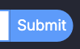

---

Visit the deployed site here: [DJ Silver Soul](https://sd-powell.github.io/portfolio_project_1/)

---

## CONTENTS

- [AUTOMATED TESTING](#automated-testing)
  - [W3C Validator](#w3c-validation)
  - [W3C CSS Validator](#css-validation)
  - [Lighthouse](#lighthouse)
- [MANUAL TESTING](#manual-testing)
  - [Full Testing](#full-testing)
  - [Browser Compatibility](#browser)
  - [Responsiveness](#responsiveness)
  - [Accessibility](#accessibility)
  - [Testing User Stories](#testing-user)
  - [Features Testing](#features-test)
  - [Existing Features](#existing-features)
  - [Manual Features Testing](#manual-features-test)

Testing was conducted continuously throughout the development process to ensure a functional and user-friendly website. Chrome Developer Tools were extensively utilised during the build to identify and resolve issues promptly. Regular testing allowed for a smoother development process and ensured the final product met quality standards.

Throughout the development process, ChatGPT was utilised as a valuable resource for brainstorming ideas, refining content, and troubleshooting challenges. By offering alternative solutions and best practices, ChatGPT contributed significantly to the website’s overall quality and functionality.

Each page is tested using Chrome Developer Tools to ensure that it is responsive on a variety of different screen sizes and devices.

---

## AUTOMATED TESTING

### W3C Validator

[W3C](https://validator.w3.org/) was used to validate the HTML on all pages of the website.

| Directory | File tested | Screenshot | Notes |
| --------- | ----------- | ---------- | ----- |
| documentation/testing-w3c-home.webp | index.html |  | no errors occurred when checking |
| documentation/testing-w3c-404.webp | 404.html |  | no errors occurred when checking |
| documentation/testing-w3c-500.webp | 500.html |  | no errors occurred when checking |

---

### CSS Validator

[CSS W3C Validator](https://jigsaw.w3.org/css-validator/) was used to validate my CSS file.

| Directory                                | File tested  | Screenshot                                              | Notes                            |
| ---------------------------------------- | ------------ | ------------------------------------------------------- | -------------------------------- |
| documentation/testing-w3css-home.webp | style.css    |  | no errors occurred when checking |

### Lighthouse

I've tested my deployed project using the Lighthouse Audit tool to test the performance, accessibility, best practices and SEO of the website.

| Page    | Mobile                                                      | Desktop                                                      | Notes |
| ------- | ----------------------------------------------------------- | ------------------------------------------------------------ | ----- |

## Results Panel

### Overview
The **Results Panel** provides users with a summary of their quiz performance, displaying their final score and offering them the chance to submit their name to the leaderboard. It also includes navigation options to restart the quiz or exit to the home page.

### Features Tested:
- **Score Display & Feedback:**  
  - The panel **correctly displays** the user’s final score within the ``.  
  - A motivational message is included, reinforcing engagement with **"Top of the Pops"** encouragement.  

- **Leaderboard Submission Functionality:**  
  - The **name input field (`#user_name`)** allows users to enter a name (up to 20 characters).  
  - The form enforces **input validation**, preventing blank or whitespace-only submissions (`pattern="\S(.*\S)?" required`).  
  - The **"Submit" button (`#submit_score`)** correctly registers the name and score in the leaderboard.  

- **Navigation & Call to Action:**  
  - The **"Exit" button (`#quit_quiz`)** returns users to the home page.  
  - The **"Restart Quiz" button (`#restart_quiz`)** allows users to start a new quiz session instantly.  
  - **ARIA labels** are applied to buttons for improved accessibility.  

- **Branding & Design:**  
  - The panel maintains a **consistent visual style** with the rest of the site.  
  - The **input field and buttons** are clearly distinguishable and properly styled.  
  - The layout is structured to ensure easy readability and interaction.  

- **Responsiveness & Accessibility:**  
  - The results panel adapts well to different **screen sizes** (desktop, tablet, mobile).  
  - The **form elements (`<input>`, `<button>`)** are accessible via keyboard navigation and screen readers.  
  - The use of **semantic HTML elements** (`<h2>`, `
`, `<form>`, `<input>`, `<button>`) enhances accessibility.  

- **Performance & Functionality:**  
  - The **score updates dynamically** upon quiz completion.  
  - The **submission form works correctly**, preventing invalid inputs and successfully adding scores to the leaderboard.  
  - The page loads **efficiently** without broken elements or layout shifts.  

Click here to see the Results Panel

 

## Leaderboard Panel

### Overview
The **Leaderboard Panel** provides users with a ranked list of the top 10 scores, dynamically updating based on quiz performance. It enhances user engagement by displaying competitive scores and offering options to restart or exit the quiz.

### Features Tested:
- **Leaderboard Display & Dynamic Updates:**  
  - The **top 10 scores** are displayed in a structured table format.  
  - The `<tbody>` section dynamically updates with user scores after quiz completion.  
  - **Ranks, names, and scores** are correctly displayed in descending order.  

- **Navigation & Call to Action:**  
  - The **"Exit" button** allows users to return to the home page.  
  - The **"Restart Quiz" button** lets users immediately begin a new quiz session.  
  - **ARIA labels** are applied to buttons for improved accessibility.  

- **Branding & Design:**  
  - The panel maintains the **consistent styling** of the site.  
  - Uses **clear, readable fonts** and a structured table format for clarity.  
  - Buttons follow the **expected UI conventions** (`outline_btn` for exit, `reverse_btn` for restart).  

- **Responsiveness & Accessibility:**  
  - The leaderboard layout adapts to different **screen sizes** (desktop, tablet, mobile).  
  - Uses **semantic HTML elements** (`<table>`, `<th>`, `<tbody>`) to ensure proper screen reader support.  
  - Button labels and interactive elements comply with **ARIA accessibility guidelines**.  

- **Performance & Functionality:**  
  - The leaderboard updates **instantly** after the quiz is completed.  
  - The **Exit and Restart buttons** work as expected, redirecting users appropriately.  
  - The page loads **without delays or broken styling**, ensuring a smooth user experience.  

Click here to see the Leaderboard Panel

 

## 404 Page

### Overview
The **404 Page Not Found** error page provides a fun and engaging experience for users who land on a non-existent or unavailable page. It embraces the **musical quiz theme** by presenting a playful message that keeps users entertained while guiding them back to the quiz.

### Features Tested:
- **Clear & Engaging Messaging:**  
  - The page displays a **music-themed error message**: *"404: Question Not Found!"*  
  - The wording aligns with the **pop quiz theme**, making the experience more engaging.  
  - Avoids overly technical language and reassures users they can easily navigate back.

- **Navigation & Call to Action:**  
  - Provides a **link back to the quiz homepage** to ensure users can quickly resume their session.  
  - Uses an **ARIA label** for accessibility, ensuring screen readers describe the link clearly.  
  - Prevents users from feeling "stuck" by offering a clear way forward.

- **Branding & Design:**  
  - Maintains **branding consistency** with the rest of the website.  
  - Features an **error icon (fa-solid fa-ban)** to visually indicate an issue.  
  - Uses a **friendly, playful tone** that aligns with the quiz experience.  

- **Responsiveness & Accessibility:**  
  - The page adapts well to different **screen sizes** and devices (desktop, tablet, mobile).  
  - Uses **semantic HTML** (e.g., `<h2>` for headings, `
` for descriptions) to enhance readability.  
  - ARIA labels improve usability for **assistive technologies**, ensuring smooth navigation.  

- **Performance & Functionality:**  
  - The **homepage link** works correctly and redirects users back to the quiz.  
  - The page **loads quickly**, even if the requested URL does not exist.  
  - The **error icon and text display correctly** without any layout shifts or broken styling.  

Click here to see the 404 page

   

  ## 500 Page

### Overview
The **500 Internal Server Error page** provides a fun, engaging message that reassures users when a server-side issue occurs. It maintains a **musical theme** that aligns with the site’s branding while guiding users toward possible solutions.

### Features Tested:
- **Clear & Engaging Messaging:**  
  - The page presents a humorous and **on-brand error message**: *"The beat stopped, and the server lost the rhythm!"*  
  - Avoids technical jargon and reassures users that the issue is being addressed.

- **Navigation & Call to Action:**  
  - Provides a **reload option** to encourage users to retry accessing the site.  
  - Includes a **link back to the homepage** for easy recovery.  
  - Uses **ARIA labels** to enhance accessibility for screen readers.

- **Branding & Design:**  
  - Maintains the **musical theme** with a relevant message.  
  - Uses an **error icon (fa-solid fa-triangle-exclamation)** to visually indicate an issue.  
  - Consistent color scheme and typography ensure a seamless user experience.

- **Responsiveness & Accessibility:**  
  - The page adapts well to different **screen sizes** and devices (desktop, tablet, mobile).  
  - Uses **semantic HTML** (e.g., `<h2>` for headings, `
` for descriptions) for better readability.  
  - ARIA labels improve usability for **assistive technologies**.

- **Performance & Functionality:**  
  - The **homepage link** and **reload option** function as expected.  
  - The page **loads quickly**, even during server issues.  
  - The **error icon and text display correctly** without layout shifts.

Click here to see the 500 page

 

#### Manual Features Testing

`Home Page`

| Component | Expected Behavior | Testing Steps | Actual Result | Fix (if needed) | Screenshot |
| --- | --- | --- | --- | --- | --- |
| **Rules** button | The **rules** panel should open, displaying instructions on how to play the quiz | Clicked on the **rules** button | The **rules** panel opened and displayed the instructions correctly | ✅ No fix needed |  |
| **Leaderboard** button | The **leaderboard** panel should open and display the top 10 scores, ranked by position, player name, and score | Clicked on the **leaderboard** button | The **leaderboard** panel opened and displayed the top 10 scores correctly | ✅ No fix needed |  |
| **Start** button | The **difficulty** panel should open, displaying three buttons that allow the user to choose between *Easy*, *Medium*, or *Hard* quiz questions | Clicked on the **Start** button | The **difficulty** panel opened and displayed the three difficulty buttons | ✅ No fix needed |  |
| **Rules** and **Leaderboard** buttons - hover effect | When hovered over, the **Rules** and **Leaderboard** buttons should change to a white background with light blue text | Hovered over the **Rules** and **Leaderboard** buttons | The **Rules** and **Leaderboard** buttons changed to a white background with light blue text when hovered over | ✅ No fix needed |     |
| **Start** button - hover effect | When hovered over, the **Start** button should change from dark blue text to white text | Hovered over the **Start** button | The **Start** button changed from dark blue text to white text when hovered over | ✅ No fix needed |   |

---

`Quiz Rules Page`

| Component | Expected Behavior | Testing Steps | Actual Result | Fix (if needed) | Screenshot |
| --- | --- | --- | --- | --- | --- |
| **Exit** button | The **rules** panel should close, revealing the home page panel | Clicked on the **Exit** button | The **rules** panel closed, and the home page panel was revealed | ✅ No fix needed |  |
| **Start Quiz** button | The **difficulty** panel should open, displaying three buttons that allow the user to choose between *Easy*, *Medium*, or *Hard* quiz questions | Clicked on the **Start Quiz** button | The **difficulty** panel opened and displayed the three difficulty buttons | ✅ No fix needed |  |
| **Exit** button - hover effect | When hovered over, the **Exit** button should change to a white background with light blue text | Hovered over the **Exit** button | The **Exit** button changed to a white background with light blue text when hovered over | ✅ No fix needed |   |
| **Start Quiz** button - hover effect | When hovered over, the **Start** button should change from dark blue text to white text | Hovered over the **Start** button | The **Start** button changed from dark blue text to white text when hovered over | ✅ No fix needed |   |

---

`Leaderboard Page`

| Component | Expected Behavior | Testing Steps | Actual Result | Fix (if needed) | Screenshot |
| --- | --- | --- | --- | --- | --- |
| **Exit** button | The **leaderboard** panel should close, revealing the **home page** panel | Clicked on the **Exit** button | The **leaderboard** panel closed, and the **home page** panel was revealed | ✅ No fix needed |  |
| **Restart Quiz** button | The **difficulty** panel should open, displaying three buttons that allow the user to choose between *Easy*, *Medium*, or *Hard* quiz questions | Clicked on the **Restart Quiz** button | The **difficulty** panel opened and displayed the three difficulty buttons | ✅ No fix needed |  |
| **Scores** are displayed | If the user achieves and submits a score that ranks within the top ten of previously submitted scores, it should be displayed in the  **leaderboard** table | Played the quiz and aimed to beat the lowest score in the current **leaderboard** | The highest scores in the top ten were successfully submitted and displayed in the **leaderboard** table | ✅ No fix needed | 
| **Exit** button - hover effect | When hovered over, the **Exit** button should change to a white background with light blue text | Hovered over the **Exit** button | The **Exit** button changed to a white background with light blue text when hovered over | ✅ No fix needed |   |
| **Restart Quiz** button - hover effect | When hovered over, the **Restart Quiz** button should change from dark blue text to white text | Hovered over the **Restart Quiz** button | The **Restart Quiz** button changed from dark blue text to white text when hovered over | ✅ No fix needed |   |

---

`Difficulty Page`

| Component | Expected Behavior | Testing Steps | Actual Result | Fix (if needed) | Screenshot |
| --- | --- | --- | --- | --- | --- |
| **Easy** button | The **difficulty** panel should close, revealing the **Quiz** panel. The API should be called using the easy quiz URL | Clicked on the **Easy** button | The **difficulty** panel closed, the **Quiz** panel opened. The API call was logged to the console | ✅ No fix needed |  |
| **Medium** button | The **difficulty** panel should close, revealing the **Quiz** panel. The API should be called using the medium quiz URL | Clicked on the **Medium** button | The **difficulty** panel closed, the **Quiz** panel opened. The API call was logged to the console | ✅ No fix needed |  |
| **Hard** button | The **difficulty** panel should close, revealing the **Quiz** panel. The API should be called using the hard quiz URL | Clicked on the **Hard** button | The **difficulty** panel closed, the **Quiz** panel opened. The API call was logged to the console | ✅ No fix needed |  |
| **Exit** button | The **difficulty** panel should close, revealing the **home page** panel | Clicked on the **Exit** button | The **difficulty** panel closed, and the **home page** panel was revealed | ✅ No fix needed |  |
| **Difficulty** buttons - hover effect | When hovered over, the **difficulty** buttons should change from a dark blue background to a light blue background | Hovered over each **difficulty** button | The **difficulty** buttons changed from a dark blue background to a light blue background when hovered over | ✅ No fix needed |  |
| **Exit** button - hover effect | When hovered over, the **Exit** button should change to a white background with light blue text | Hovered over the **Exit** button | The **Exit** button changed to a white background with light blue text when hovered over | ✅ No fix needed |   |

`⛔️ Difficulty Page - Negative Testing Scenarios`

| Component | Expected Behavior | Negative Test Performed | Actual Result | Fix (if needed) | Screenshot |
| --- | --- | --- | --- | --- | --- |
| Corrupt API Data | The quiz should gracefully handle missing or broken data | Modified API url to return incomplete data and selected each difficulty button to activate API call | Quiz was redirected to 500 error page | ✅ No fix needed |  |
| Score Reset on Restart | Score should reset to `0` when restarting quiz | Clicked on each **Difficulty** button in turn to restart the quiz | Score was reset to `0` each time | ✅ No fix needed |  |

---

`Quiz Page`

| Component | Expected Behavior | Testing Steps | Actual Result | Fix (if needed) | Screenshot |
| --- | --- | --- | --- | --- | --- |
| **Question no.** indicator | After the quiz begins, the **question no.** indicator should increment by 1 each time the **Next button** is clicked after a question is answered or when the timer expires  | Clicked the **Next button** after the quiz began | The **Question No.** indicator incremented by **1** when the **Next button** was clicked | ✅ No fix needed |  |
| **Timer** function | After the quiz begins, the **Timer** should count down from **15 to 0**. When the Timer reaches **0**, “Time’s up!” should be displayed. Upon clicking the **Next button**, the **Timer** should reset to “Time: 15” and start counting down again | Selected a **difficulty** level to start the quiz. Clicked the **Next** button to reset the **Timer** | The quiz began, and the **Timer** counted down from **15 to 0**. “Time’s up!” was displayed. After clicking the **Next** button, the **Timer** reset to “Time: 15” and restarted the countdown | ✅ No fix needed |  |
| **Time line** function | After the quiz begins, the Time Line should decrease in width by 1/15 for each second the timer decrements | Selected a **difficulty** level to start the quiz. Clicked the **Next** button to reset the **Timer** | The quiz began, and the **Time Line** decreased in width by 1/15 each second as the timer decremented | ✅ No fix needed |  |
| **Timer pause** function | After a question is answered, the **Timer** and **Time Line** should pause immediately | Answered a question | The **Timer** and **Time Line** paused immediately | ✅ No fix needed |  |
| **Quiz questions** and **answers** | A new set of **quiz questions** and **answers** should be displayed each time the quiz begins or the **Next** button is clicked | Selected a **difficulty** level to start the quiz. Clicked the **Next** button to access the next question | A new set of **quiz questions** and **answers** was displayed each time | ✅ No fix needed |  |
| **Correct** and **Incorrect** answer indicators | When an answer is submitted: if it is **correct**, the border of the selected answer button should turn **green**, and a **green tick icon** should appear to the right of the answer text inside the button. If the answer is **incorrect**, the border of the selected answer button should turn **red**, and a **red cross icon** should appear to the right of the answer text inside the button. If the **timer expires**, the correct answer should be highlighted with a **green border** and a **green tick icon** | Selected both **correct** and **incorrect** answers. Allowed the timer to expire | When a **correct** answer was selected, the border turned **green**, and a **green tick icon** appeared. When an **incorrect** answer was selected, the border turned **red**, and a **red cross icon** appeared. When the **timer** expired, the **correct** answer was displayed with a **green** border and a **green tick icon** | ✅ No fix needed |   |
| **Score** function | When a question is answered correctly, the **score** should increment by **10**, up to a maximum of **100** for 10 correct answers | Answered **10** questions correctly | The **score** incremented by **10** for each correct answer, reaching a maximum of **100** for **10** correct answers | ✅ No fix needed |  |
| **Next** button | When an answer is selected or when the timer expires, revealing the correct and/or incorrect answers, the **Next** button should appear. Upon clicking the **Next** button, the **next question** should be displayed, the timer should reset, the **question number** should increment, and the **Next** button should disappear | Selected an answer and allowed the timer to expire | When an answer was selected or the timer expired, the correct and/or incorrect answers were displayed, and the **Next** button appeared. Upon clicking the **Next** button, the next question was shown, the timer reset, the question number incremented, and the **Next** button disappeared | ✅ No fix needed |  |
| **Exit** button | The **quiz** panel should close and the quiz should end, revealing the **home page** panel | Clicked on the **Exit** button | The **difficulty** panel closed and the quiz ended, and the **home page** panel was revealed | ✅ No fix needed |  |
| **Answer** buttons - hover effect | When hovered over, the **Answer** buttons should change from a dark blue background to a light blue background | Hovered over each **Answer** button | The **Answer** buttons changed from a dark blue background to a light blue background when hovered over | ✅ No fix needed |  |
| **Exit** button - hover effect | When hovered over, the **Exit** button should change to a white background with light blue text | Hovered over the **Exit** button | The **Exit** button changed to a white background with light blue text when hovered over | ✅ No fix needed |   |
| **Next** button - hover effect | When hovered over, the **Next** button should change from a green background to a white background | Hovered over the **Next** button | The **Next** button changed from a green background to a white background | ✅ No fix needed |   |

`⛔️ Quiz Page - Negative Testing Scenarios`

| Component | Expected Behavior | Negative Test Performed | Actual Result | Fix (if needed) | Screenshot |
| --- | --- | --- | --- | --- | --- |
| **Timer** Expiry | Should disable answer buttons when an answer is selected or when the time is up | Selected an answer and allowed timer to expire. Clicked on each answer button | Answer buttons were disabled | ✅ No fix needed |  |
| Answering Questions Rapidly | Answering questions rapidly and clicking **Next** too fast should not break the quiz | Answered questions and clicked **next** rapidly | Questions were loaded and displayed as expected | ✅ No fix needed |  |
| Selecting Multiple Answers | Only one answer should be selected and all answer buttons should be disabled | Selected one answer | All answer buttons were disabled as expected | ✅ No fix needed |  |

---

`Results Page`

| Component | Expected Behavior | Testing Steps | Actual Result | Fix (if needed) | Screenshot |
| --- | --- | --- | --- | --- | --- |
| **Score** display | The score achieved in the quiz should be correctly displayed as `You scored: x out of 100` | Completed the quiz and noted the score | The score was displayed correctly | ✅ No fix needed |  |
| **Exit** button | The **results** panel should close, revealing the **home page** panel | Clicked on the **Exit** button | The **results** panel closed and the **home page** panel was revealed | ✅ No fix needed |  |
| **Submit** button - hover effect | When hovered over, the **Submit** button should change from dark blue text to white text | Hovered over the **Submit** button | The **Submit** button changed from dark blue text to white text when hovered over | ✅ No fix needed |   |
| **Exit** button - hover effect | When hovered over, the **Exit** button should change to a white background with light blue text | Hovered over the **Exit** button | The **Exit** button changed to a white background with light blue text when hovered over | ✅ No fix needed |   |
| **Restart Quiz** button - hover effect | When hovered over, the **Restart Quiz** button should change from dark blue text to white text | Hovered over the **Restart Quiz** button | The **Restart Quiz** button changed from dark blue text to white text when hovered over | ✅ No fix needed |   |

`⛔️ Results Page - Negative Testing Scenarios`

| Component | Expected Behavior | Negative Test Performed | Actual Result | Fix (if needed) | Screenshot |
| --- | --- | --- | --- | --- | --- |
| **Leaderboard** Name Submission - blank | Clicking on the **Submit** button while the "Enter Your Name" field is empty should activate an alert reading `Please enter your name before submitting!` | Clicked the **Submit** button while the "Enter Your Name" field was empty | An alert reading `Please enter your name before submitting!` was displayed | ✅ No fix needed |  |
| **Leaderboard** Name Submission - white space | Clicking on the **Submit** button while there is a blank space in the field should activate an alert reading `Please enter your name before submitting!` | Clicked the **Submit** button while there was a blank space in the field | An alert reading `Please enter your name before submitting!` was displayed | ✅ No fix needed |  |